class: center, middle, inverse
count: false

.center[]


---
class: title-slide, center, inverse

# `r rmarkdown::metadata$title`

# `r rmarkdown::metadata$subtitle`

## `r rmarkdown::metadata$author`

### `r rmarkdown::metadata$date`


```{r setup, include=FALSE, fig.showtext=TRUE}

# slides & formatting
options(htmltools.dir.version = FALSE)
options(crayon.enabled = TRUE)


xaringanExtra::use_xaringan_extra(c("tile_view", "animate_css", "tachyons"))

# css: [rladies-fonts, default, custom/style.css]
library(xaringanthemer)
style_solarized_light(colors = c(
  red = "#f34213",
  purple = "#3e2f5b",
  orange = "#ff8811",
  green = "#136f63",
  white = "#FFFFFF",
  blue = " #0000FF"
))

# R stuff
library(ggplot2)
nice_theme <- theme_xaringan()+theme(text=element_text(size=9),panel.border=element_blank(),strip.text=element_text(size=rel(0.8)),axis.text=element_text(size=8),panel.grid.minor=element_blank(),axis.line=element_line(size=.4), axis.title=element_text(size=11), legend.title=element_text(size=11))
theme_set(nice_theme)

background_plot <- nice_theme$plot.background$colour
knitr::opts_knit$set(global.par = TRUE) # fix par for multiple plots

library(tidyverse)
library(kableExtra)
```


---
class: inverse

# Program for today

- **Part 1** Mathematical functions, some calculus and Fourier transformation
--


- **Part 2** Introduction to linear algebra


<!-- Most importantly, be kind to yourself. Math anxiety is common, but it does not reflect your ability. With the right -->
<!-- strategies and persistence, you can overcome these feelings. Approach the -->
<!-- material at your own pace, celebrate small victories and remember that struggling -->
<!-- is part of the learning process. What matters most is your willingness to engage -->
<!-- and keep trying. -->


---
### Polynomial functions 

$$ y = x$$

```{r, fig.height=5.3,fig.width=4.8, dev='svg', echo=F, message=F, fig.align='center'}
x <- seq(-1,1,1/10)
par(bg = background_plot)
plot(x,x, xlab="",ylab="",type="l",col="blue",lwd=3, bty="n")
abline(h=0, lty=2)
abline(v=0, lty=2)

```

---
### Polynomial functions 

$$ y = x^2$$

```{r, fig.height=5.3,fig.width=4.8, dev='svg', echo=F, message=F, fig.align='center'}
x <- seq(-1,1,1/20)
par(bg = background_plot)
plot(x,x^2, xlab="",ylab="",type="l",col="blue",lwd=3, bty="n")
abline(h=0, lty=2)
abline(v=0, lty=2)

```

---
### Polynomial functions 

$$y = \frac{1}{5}x^3 + x^2 - 1$$

```{r, fig.height=5.3,fig.width=4.8, dev='svg', echo=F, message=F, fig.align='center'}
x <- seq(-6,6,1/10)
par(bg = background_plot)
plot(x,1/5*x^3 + x^2 -1, xlab="",ylab="",type="l",col="blue",lwd=3, bty="n")
abline(h=0, lty=2)
abline(v=0, lty=2)

```


---
# Function notation

To show that $y$ is a function of $x$ we write

.center[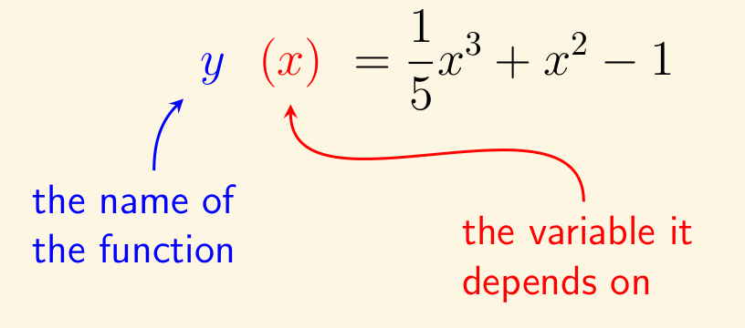]

--

if a function depends on multiple variables we write

$$y(x,t) = x^2 + t + xt$$


---
### Exponential function 

$$y = \exp(x) = e^x$$
where $e$ is the Euler number $e=2.7182818284590452353\ldots$


```{r, fig.height=5.3,fig.width=4.8, dev='svg', echo=F, message=F, fig.align='center'}
x <- seq(-3,3,1/10)
par(bg = background_plot)
plot(x,exp(x), xlab="",ylab="",type="l",col="blue",lwd=3, bty="n")
abline(h=0, lty=2)
abline(v=0, lty=2)

```

--

Proper


---
### Logarithm function

Logarithmic function with base $e$

$$y = \log_e(x) = \ln(x)$$

It's the inverse of the exponential function: if $y=e^x$, then $x = \log_e(y)$

```{r, fig.height=5.3*0.8,fig.width=4.8*0.8, dev='svg', echo=F, message=F, fig.align='center'}
x <- seq(0, 20,1/10)
par(bg = background_plot)
plot(x,log(x), xlab="",ylab="",type="l",col="blue",lwd=3, bty="n")
abline(h=0, lty=2)
abline(v=0, lty=2)

```


---
class: inverse

### Logarithmic Arithmetic

Multiplying two exponential leads to addition: 
$$b^{x_1} \times b^{x_2} = b^{x_1 + x_2}$$

--

Conversely, the sum of two logarithms can be expressed as the logarithm of their product

$$\log(x_1 \times x_2) =  \log(x_1) + \log(x_2)$$

--

This property comes hand when we are calculating the _joint probability_ of many independent events. This is computed as the product of individual probabilities, and it is often convenient to turn this into a sum using logarithms.


---
# Differentiation 

- How does a function $y$ vary with $x$?
--


- that is, given a change in $x$ of $\Delta x$, what is $\Delta y$, the corresponding change in $y$?


---

# Differentiation 

For a straight line:


```{r, fig.height=3,fig.width=3, dev='svg', echo=F, message=F, fig.align='center', out.width="40%"}
# Define a linear function
linear_function <- function(x) {
  2 * x + 1
}

# Create a dataframe for the line
line_data <- data.frame(x = seq(1.5, 5.5, length.out = 100)) %>%
  mutate(y = linear_function(x))

# Points to annotate on the graph
points_data <- data.frame(x = c(2, 5), y = c(linear_function(2), linear_function(5)))

# Plot the line and points
ggplot() +
  geom_line(data = line_data, aes(x = x, y = y), color = "black") +
  geom_point(data = points_data, aes(x = x, y = y), color = "black") +
  # geom_text(data = points_data, aes(x = x, y = y, label = c('y(x1)', 'y(x2)')),
  #           nudge_x = c(-0.5, 0.5), nudge_y = c(-1, 1), color = "black") +
  geom_segment(aes(x = 2, y = 0, xend = 2, yend = linear_function(2)), linetype = "dotted") +
  geom_segment(aes(x = 5, y = 0, xend = 5, yend = linear_function(5)), linetype = "dotted") +
  geom_segment(aes(x = 0, y = linear_function(5), xend = 5, yend = linear_function(5)), linetype = "dotted") +
  geom_segment(aes(x = 0, y = linear_function(2), xend = 2, yend = linear_function(2)), linetype = "dotted") +
  geom_segment(aes(x = 2, y = linear_function(5), xend = 5, yend = linear_function(5)),
               arrow = arrow(type = "closed", ends="both", length = unit(0.1, "inches")), color = "red") +
  geom_segment(aes(x = 5, y = linear_function(2), xend = 5, yend = linear_function(5)),
               arrow = arrow(type = "closed", ends="both",length = unit(0.1, "inches")), color = "blue") +
  annotate("text", x = 3.5, y = linear_function(5) + 1, label = "Δx", color = "red") +
  annotate("text", x = 5.5, y = linear_function(3.5), label = "Δy", color = "blue") +
  scale_x_continuous(breaks = c(2, 5), labels = c(expression('x'[1]), expression('x'[2]))) +
  scale_y_continuous(breaks = c(linear_function(2), linear_function(5)), labels = c(expression(paste('y(x'[1],')')), expression(paste('y(x'[2],')')))) +
  coord_cartesian(xlim=c(1.5,5.5),ylim=linear_function(c(1.5,5.5))) +
  theme_minimal() +
  nice_theme + 
  theme(panel.grid.major = element_line(color = "grey80"),
        axis.text.x = element_text(color = "black"),
        axis.text.y = element_text(color = "black"),
        panel.background = element_blank(),
        axis.line = element_line(color = "black"))

```


--

The .orange[*gradient*] is: 

$$\frac{\Delta y}{\Delta x} = \frac{y(x_2)-y(x_1)}{x_2 - x_1}$$


---
# Differentiation 

A curve can be approximated with a series of lines each of length $\Delta x$


```{r, fig.height=3,fig.width=4, dev='svg', echo=F, message=F, fig.align='center', out.width="60%"}
# Define a quadratic function
quadratic_function <- function(x) {
  -x^2 + 6*x
}

# Create a dataframe for the curve
curve_data <- data.frame(x = seq(1, 7, length.out = 100)) %>%
  mutate(y = quadratic_function(x))

# Define the points where Δx is marked
delta_x_points <- data.frame(x = seq(1, 7,length.out=5), 
                             #y = rep(quadratic_function(7), 3),
                             y = quadratic_function(seq(1, 7,length.out=5)))

# Plot the curve and delta_x annotations
ggplot() +
  geom_line(data = curve_data, aes(x = x, y = y), color = "blue", linewidth = 1) +
  geom_segment(aes(x = delta_x_points$x[1], y = -7, xend = delta_x_points$x[2], yend = -7),
               arrow = arrow(type = "closed", ends="both", length = unit(0.1, "inches")), color = "black") +
  geom_segment(aes(x = delta_x_points$x[2], y = -7, xend = delta_x_points$x[3], yend = -7),
               arrow = arrow(type = "closed", ends="both", length = unit(0.1, "inches")), color = "black") +
  geom_segment(aes(x = delta_x_points$x[3], y = -7, xend = delta_x_points$x[4], yend = -7),
               arrow = arrow(type = "closed", ends="both", length = unit(0.1, "inches")), color = "black") +
  geom_segment(aes(x = delta_x_points$x[4], y = -7, xend = delta_x_points$x[5], yend = -7),
               arrow = arrow(type = "closed", ends="both", length = unit(0.1, "inches")), color = "black") +
  annotate("text", x = mean(delta_x_points$x[1:2]), y = -6.5, label = "Δx", color = "black") +
  annotate("text", x = mean(delta_x_points$x[2:3]), y = -6.5, label = "Δx", color = "black") +
  annotate("text", x = mean(delta_x_points$x[3:4]), y = -6.5, label = "Δx", color = "black") +
  annotate("text", x = mean(delta_x_points$x[4:5]), y = -6.5, label = "Δx", color = "black") +
  geom_segment(aes(x = delta_x_points$x[1], y = delta_x_points$y[1], xend = delta_x_points$x[2], yend = delta_x_points$y[2]), color = "black", linewidth=1) +
  geom_segment(aes(x = delta_x_points$x[2], y = delta_x_points$y[2], xend = delta_x_points$x[3], yend = delta_x_points$y[3]), color = "black", linewidth=1) +
  geom_segment(aes(x = delta_x_points$x[3], y = delta_x_points$y[3], xend = delta_x_points$x[4], yend = delta_x_points$y[4]), color = "black", linewidth=1) +
  geom_segment(aes(x = delta_x_points$x[4], y = delta_x_points$y[4], xend = delta_x_points$x[5], yend = delta_x_points$y[5]), color = "black", linewidth=1) +
  theme_minimal() +
  nice_theme+
  theme(panel.grid.major = element_line(color = "grey80"),
        axis.text.x = element_text(color = "black"),
        axis.text.y = element_text(color = "black"),
        panel.background = element_blank(),
        axis.line = element_line(color = "black"),
        axis.title.x = element_blank(),
        axis.title.y = element_blank(),
        axis.ticks.length = unit(-0.25, "inches"),
        plot.margin = unit(c(1, 1, 1, 1), "lines")) + 
  # Other layers and settings
  theme(
    axis.line = element_blank(),
    axis.text.x = element_blank(),
    axis.text.y = element_blank(),
    axis.ticks = element_blank(),
    axis.title.x = element_blank(),
    axis.title.y = element_blank()
  )

```


--

The shorter the lines, the more accurate the approximation.


It becomes _precise_ as $\Delta x \rightarrow 0$


---
class: inverse

# Differentiation 

Differentiating the function $y(x) = x^2$

.center[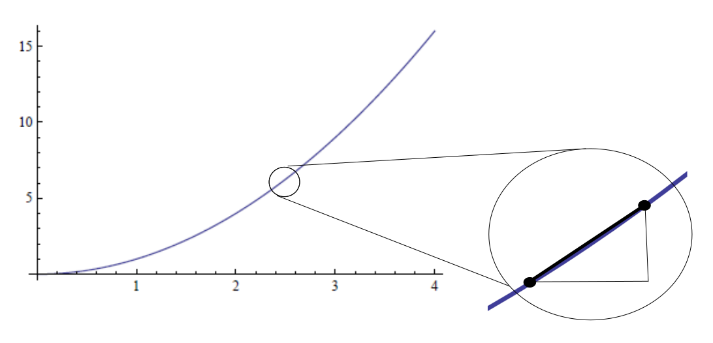]

--

$$\frac{dy}{dx} = \lim_{\Delta x \rightarrow 0} \frac{y(x + \Delta x)-y(x)}{(x + \Delta x) - x}$$

---
class: inverse

# Differentiation

Differentiating the function $y(x) = x^2$

<!-- $$\begin{align} -->
<!-- \frac{dy}{dx} &= \lim_{\Delta x \rightarrow 0} \frac{y(x + \Delta x)-y(x)}{(x + \Delta x) - x}\\ -->
<!-- &=\lim_{\Delta x\to 0 }\frac{(x+\Delta x)^2-x^2}{\Delta x} \\ -->
<!-- &=\lim_{\Delta x\to 0}\frac{(x^2+2x\Delta x+(\Delta x)^2)-x^2}{\Delta x} \\ -->
<!-- &=\lim_{\Delta x\to 0}\frac{2x\Delta x+h^2}{\Delta x} \\ -->
<!-- &=\lim_{\Delta x\to 0}2x+\Delta x \\ -->
<!-- &= 2x -->
<!-- \end{align}$$ -->

$$\begin{align}
\frac{dy}{dx} &= \lim_{\Delta x \rightarrow 0} \frac{y(x + \Delta x)-y(x)}{(x + \Delta x) - x}\end{align}$$

---
class: inverse
count: false

# Differentiation

Differentiating the function $y(x) = x^2$


$$\begin{align}
\frac{dy}{dx} &= \lim_{\Delta x \rightarrow 0} \frac{y(x + \Delta x)-y(x)}{(x + \Delta x) - x}\\
&=\lim_{\Delta x\to 0 }\frac{(x+\Delta x)^2-x^2}{\Delta x}
\end{align}$$


---
class: inverse
count: false

# Differentiation

Differentiating the function $y(x) = x^2$

$$\begin{align}
\frac{dy}{dx} &= \lim_{h \rightarrow 0} \frac{y(x + h)-y(x)}{(x + h) - x}\\
&=\lim_{h\to 0 }\frac{(x+h)^2-x^2}{h} \end{align}$$


---
class: inverse
count: false

# Differentiation

Differentiating the function $y(x) = x^2$

$$\begin{align}
\frac{dy}{dx} &= \lim_{h \rightarrow 0} \frac{y(x + h)-y(x)}{(x + h) - x}\\
&=\lim_{h\to 0 }\frac{(x+h)^2-x^2}{h} \\
&=\lim_{h\to 0}\frac{x^2+2xh+h^2-x^2}{h} 
\end{align}$$

---
class: inverse
count: false

# Differentiation

Differentiating the function $y(x) = x^2$

$$\begin{align}
\frac{dy}{dx} &= \lim_{h \rightarrow 0} \frac{y(x + h)-y(x)}{(x + h) - x}\\
&=\lim_{h\to 0 }\frac{(x+h)^2-x^2}{h} \\
&=\lim_{h\to 0}\frac{x^2+2xh+h^2-x^2}{h} \\
&=\lim_{h\to 0}\frac{2xh+h^2}{h} 
\end{align}$$
---
class: inverse
count: false

# Differentiation

Differentiating the function $y(x) = x^2$

$$\begin{align}
\frac{dy}{dx} &= \lim_{h \rightarrow 0} \frac{y(x + h)-y(x)}{(x + h) - x}\\
&=\lim_{h\to 0 }\frac{(x+h)^2-x^2}{h} \\
&=\lim_{h\to 0}\frac{x^2+2xh+h^2-x^2}{h} \\
&=\lim_{h\to 0}\frac{(2x+h)h}{h} 
\end{align}$$


---
class: inverse
count: false

# Differentiation

Differentiating the function $y(x) = x^2$

$$\begin{align}
\frac{dy}{dx} &= \lim_{h \rightarrow 0} \frac{y(x + h)-y(x)}{(x + h) - x}\\
&=\lim_{h\to 0 }\frac{(x+h)^2-x^2}{h} \\
&=\lim_{h\to 0}\frac{x^2+2xh+h^2-x^2}{h} \\
&=\lim_{h\to 0}\frac{2xh+h^2}{h} \\
&=\lim_{h\to 0}2x+h 
\end{align}$$
---
class: inverse
count: false

# Differentiation

Differentiating the function $y(x) = x^2$

$$\begin{align}
\frac{dy}{dx} &= \lim_{h \rightarrow 0} \frac{y(x + h)-y(x)}{(x + h) - x}\\
&=\lim_{h\to 0 }\frac{(x+h)^2-x^2}{h} \\
&=\lim_{h\to 0}\frac{x^2+2xh+h^2-x^2}{h} \\
&=\lim_{h\to 0}\frac{2xh+h^2}{h} \\
&=\lim_{h\to 0}2x+h \\
&= 2x
\end{align}$$

---

# Differentiation

| $y(x)$	| $\frac{dy}{dx}$ 	|
|-----------	|---------	|
|	$x$ | $1$	|
|	$x^2$ | $2x$	|
|	$x^3$ | $3x^2$	|
|	$\vdots$ | $\vdots$	|
|	$x^n$ | $nx^{n-1}$	|
|	$\sin(x)$ | $cos(x)$	|
|	$\cos(x)$ | $-\sin(x)$	|
|	$e^x$ | $e^x$	|


---

# Numerical differentiation

For digital signals that are described by a discrete set of points or sample we can estimate the derivative using a _finite difference_ approach.

.center[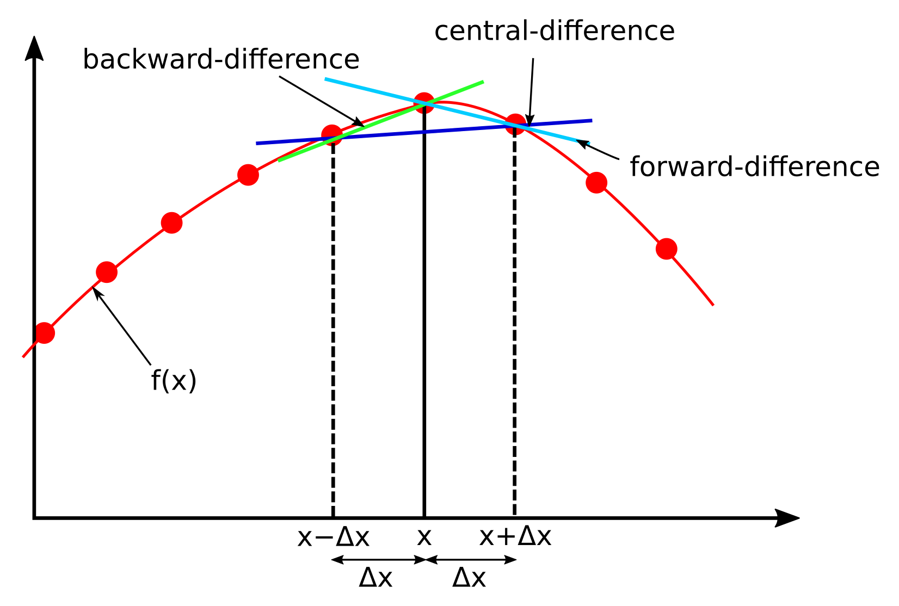]

---
class: inverse

### Example: differentiation gaze position to compute gaze velocity


.center[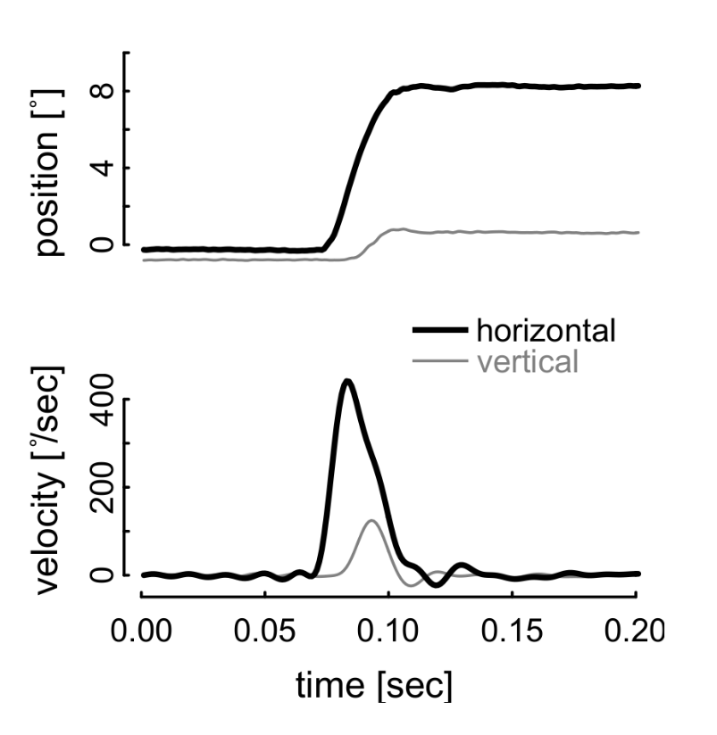]


---
### Probability _density_ functions

Normal or Gaussian distribution:

$$p(x) = \frac{1}{\sigma \sqrt{2 \pi}} e^{-\frac{1}{2} \left( \frac{x - \mu}{\sigma} \right)^2}$$

```{r, fig.height=4.5,fig.width=5.8, dev='svg', echo=F, message=F, fig.align='center'}
x <- seq(-6,6,1/10)
par(bg = background_plot)
plot(x,dnorm(x), xlab="x",ylab="probability 'density'",type="l",col="blue",lwd=3, bty="n")
abline(h=0, lty=2)
abline(v=0, lty=2)

text(3, 0.3, expression(mu == 0), cex = 1.1, col="blue")
text(3, 0.27, expression(sigma == 1), cex = 1.1, col="blue")
```

---
#### Understanding the equation of the normal distribution

```{r, fig.height=5.3,fig.width=7.5, dev='svg', echo=F, message=F, fig.align='center'}

put.fig.letter <- function(label, location="topleft", x=NULL, y=NULL, 
                           offset=c(0, 0), ...) {
  if(length(label) > 1) {
    warning("length(label) > 1, using label[1]")
  }
  if(is.null(x) | is.null(y)) {
    coords <- switch(location,
                     #topleft = c(0.015,0.98),
                     topleft = c(0.025,0.98),
                     topcenter = c(0.5525,0.98),
                     topright = c(0.985, 0.98),
                     bottomleft = c(0.015, 0.02), 
                     bottomcenter = c(0.5525, 0.02), 
                     bottomright = c(0.985, 0.02),
                     c(0.015, 0.98) )
  } else {
    coords <- c(x,y)
  }
  this.x <- grconvertX(coords[1] + offset[1], from="nfc", to="user")
  this.y <- grconvertY(coords[2] + offset[2], from="nfc", to="user")
  text(labels=label[1], x=this.x, y=this.y, xpd=T, ...)
}


x <- seq(-6, 6, 0.05)  

par(mfrow=c(2,3), mar=c(5,4,1.5,1)+0.1, bg = background_plot)

plot(x, x, type="l", lwd=2, col="black") 
put.fig.letter(label=" (a)", location="topleft", font=2)

plot(x, x^2, type="l", lwd=2, col="black", ylab=expression(x^2)) 
put.fig.letter(label=" (b)", location="topleft", font=2)

plot(x, -x^2, type="l", lwd=2, col="black", ylab=expression(-x^2))
put.fig.letter(label=" (c)", location="topleft", font=2)

plot(x, -(x-1)^2, type="l", lwd=2, col="black", ylab=expression(-(x-mu)^2)) 
lines(x, -(x+2)^2, type="l", lwd=2, col="#7E03A8FF", lty=2)
text(4, -1.5, labels=expression(mu==1), col="black")
text(-5, -1.5, labels=expression(mu==-2), col="#7E03A8FF")
put.fig.letter(label=" (d)", location="topleft", font=2)

plot(x, exp(-(x-1)^2), type="l", lwd=2, col="black", ylab=expression(exp(-(x-mu)^2)) )
lines(x, exp(-(x+2)^2), type="l", lwd=2, col="#7E03A8FF", lty=2)
text(4, 0.8, labels=expression(mu==1), col="black")
text(-5, 0.8, labels=expression(mu==-2), col="#7E03A8FF")
put.fig.letter(label=" (e)", location="topleft", font=2)


```


---
### Probability _mass_ functions

Binomial distribution:

$$\Pr(x) = {n\choose k} p^k(1-p)^{n-k}$$

```{r, fig.height=4.5,fig.width=5.8, dev='svg', echo=F, message=F, fig.align='center'}

par(bg = background_plot, mfrow=c(1,1))

simplepmf_binom <- function(size, prob,
                            xlab = "k", ylab = "probability 'mass'",
                            off = 0.20, lwd = 3,
                            col = c("black", "#8080FF"),
                            pch_top = 16, top_cex = 1,
                            ...) {
  stopifnot(length(size) == 1, size >= 0)

  k <- 0:size
  prob <- as.vector(prob)
  m <- length(prob)

  # compute pmf(s)
  Y <- sapply(prob, function(p) dbinom(k, size, p))
  if (is.null(dim(Y))) Y <- cbind(Y)  # ensure matrix

  if (length(col) < m) col <- rep_len(col, m)

  # limits & empty canvas
  ylim <- c(0, max(Y))
  xlim <- range(k) + c(-1, 1) * off
  plot(NULL, xlim = xlim, ylim = ylim, xlab = xlab, ylab = ylab,
       bty = "n", xaxt = "n", ...)
  axis(1, at = k)                 # integer ticks
  abline(h = 0, lty = 2, col = "gray60")

  # draw sticks (and optional dots at the top)
  for (i in seq_len(m)) {
    xoff <- (i - 1) * off
    for (j in seq_along(k)) {
      lines(c(k[j], k[j]) + xoff, c(0, Y[j, i]), lwd = lwd, col = col[i])
      if (!is.null(pch_top)) {
        points(k[j] + xoff, Y[j, i], pch = pch_top, cex = top_cex, col = col[i])
      }
    }
  }

  invisible(Y)
}

simplepmf_binom(size = 10, prob = 1/6,
                main = " ",
                col = "blue")

text(6, 0.27, expression(n == 10), cex = 1.1, col="blue")
text(6, 0.2, expression(p == frac(1, 6)), cex = 1.1, col="blue")

```

_Note: this is a discrete function, and therefore not differentiable._


---
### Trigonometric functions

$$y = \sin(x)$$

```{r, fig.height=5.3,fig.width=5.8, dev='svg', echo=F, message=F, fig.align='center'}
x <- seq(-6,6,1/10)
par(bg = background_plot)
plot(x,sin(x), xlab="",ylab="",type="l",col="blue",lwd=3, bty="n")
abline(h=0, lty=2)
abline(v=0, lty=2)

```


---
### Trigonometric functions


.center[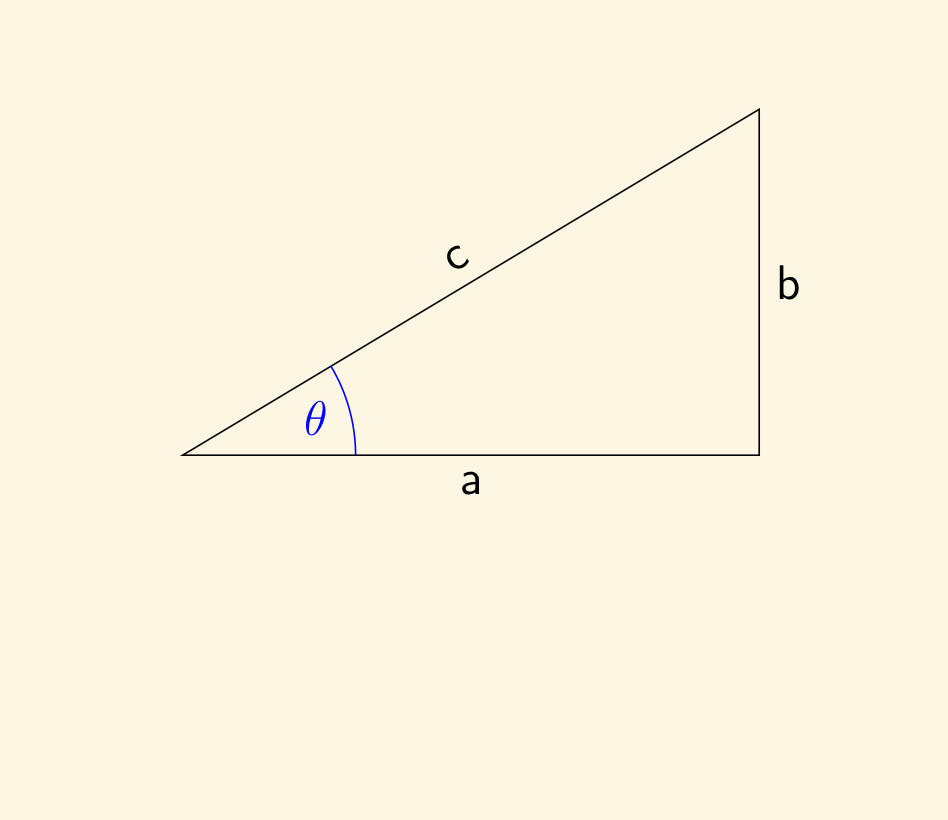]


---
count: false

### Trigonometric functions


.center[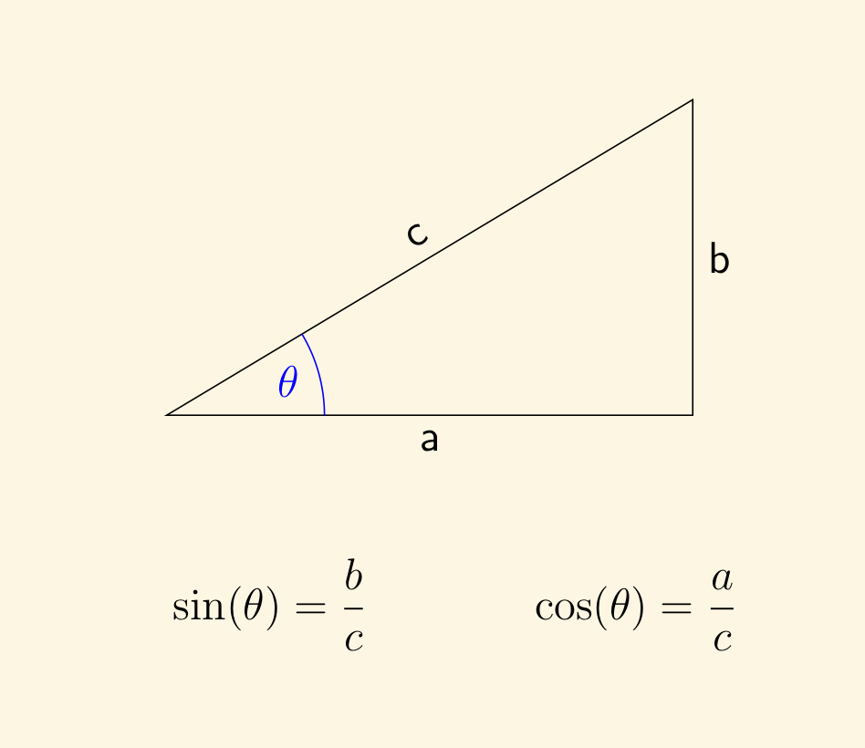]


---
count: false

### Trigonometric functions


.center[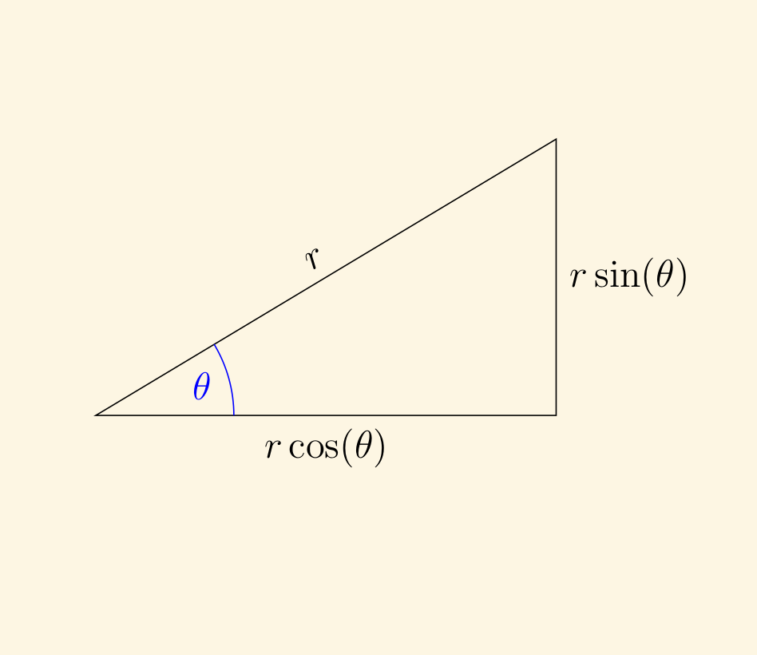]


---
### Trigonometric functions


.center[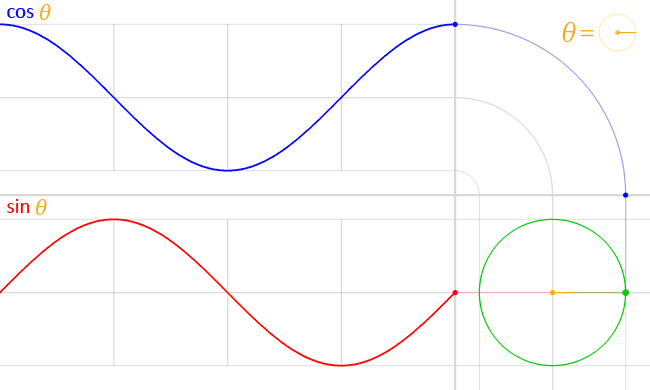]


---
### Degrees vs Radians


$$360 \, \text{degrees} = 2\pi \, \text{radians}$$
where $\pi = 3.14159265359 \ldots$


--

.center[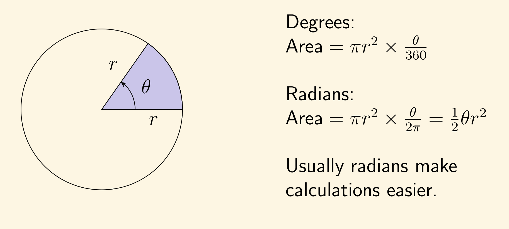]


---
### Trigonometric functions


```{r, fig.height=4.3,fig.width=6.8, dev='svg', echo=F, message=F, fig.align='center'}
x <- seq(-7,7,1/10)
par(bg = background_plot)
plot(x,sin(x), xlab="",ylab="",type="l",col="blue",lwd=3, bty="n")
abline(h=0, lty=2)
abline(v=0, lty=2)
lines(x,cos(x), col="red",lwd=3)
legend('topleft',c("sin(x)","cos(x)"), lwd=3, col=c("blue","red"),inset=0.1)
```

--
- Sine and cosine functions takes angles as input, and return numbers between -1 and 1 as outputs

--
- Can be used to model _oscillations_ (phenomena with repeated/period variation)

--
- Real-world oscillations are not simply periodical


---
class: inverse
Oscillations in scalp EEG activity

.center[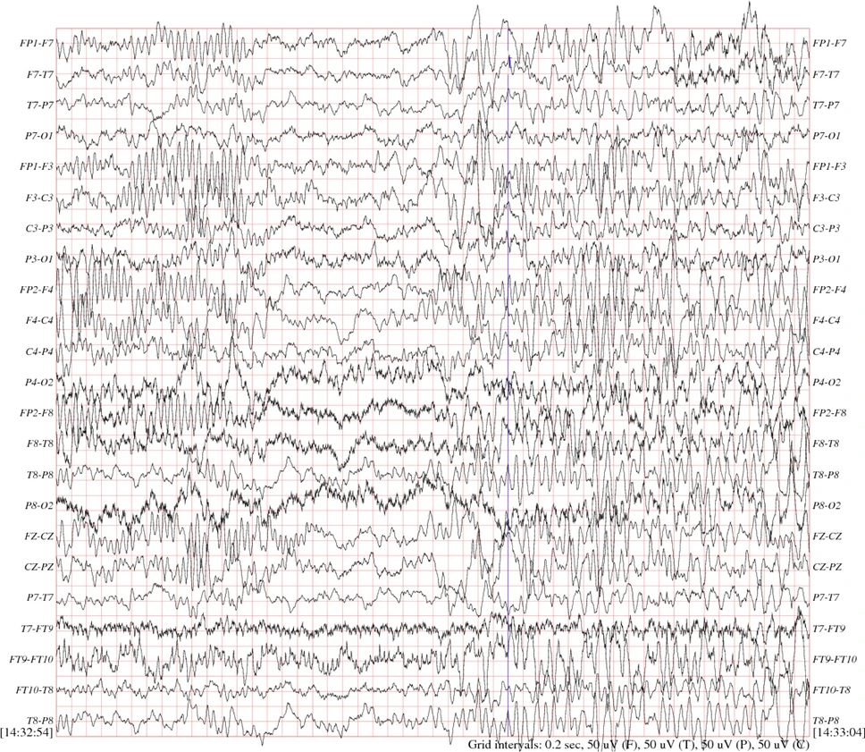]


---
Monthly cycle in women's body temperature

```{r, fig.height=3.5,fig.width=7.8, dev='svg', echo=F, message=F, fig.align='center'}

par(bg = background_plot, mfrow=c(1,2))

x <- seq(0,24*2,length.out=1e3)
temp <- 36.8 + 0.3*cos((2*pi*(x-14))/24)
plot(x,temp, xlab="time [hours]",ylab="temperature [°C]",type="l",col="blue",lwd=3, bty="n", xaxt="n", main ="Daily temperature cycle")
abline(h=36.8, lty=2)
axis(1, at=seq(0,24*2,6), labels=c(seq(0,24-6,6),seq(0,24,6)))


x <- seq(0,28*2,length.out=1e3)
temp <- 36.8 + 0.2*cos((2*pi*(x-16))/28)
plot(x,temp, xlab="time [days]",ylab="temperature [°C]",type="l",col="blue",lwd=3, bty="n", xaxt="n", main ="Monthly temperature cycle")
abline(h=36.8, lty=2)
axis(1, at=seq(0,28*2,7), labels=c(seq(0,28-7,7),seq(0,28,7)))


```

--

| 	| minimum	| maximum	| average	| time of max.	| period	|
|-----------	|--------	|--------	|--------	|--------	|
|	Daily cycle | 36.5| 37.1 | 36.8 | 14:00 | 24 hours |
|	Monthly cycle | 36.6	| 37.0 | 36.8 | day 16 | 28 days |


---
count: false
Monthly cycle in women's body temperature

```{r, fig.height=3.5,fig.width=7.8, dev='svg', echo=F, message=F, fig.align='center'}

par(bg = background_plot, mfrow=c(1,2))

x <- seq(0,24*2,length.out=1e3)
temp <- 36.8 + 0.3*cos((2*pi*(x-14))/24)
plot(x,temp, xlab="time [hours]",ylab="temperature [°C]",type="l",col="blue",lwd=3, bty="n", xaxt="n", main ="Daily temperature cycle")
abline(h=36.8, lty=2)
axis(1, at=seq(0,24*2,6), labels=c(seq(0,24-6,6),seq(0,24,6)))


x <- seq(0,28*2,length.out=1e3)
temp <- 36.8 + 0.2*cos((2*pi*(x-16))/28)
plot(x,temp, xlab="time [days]",ylab="temperature [°C]",type="l",col="blue",lwd=3, bty="n", xaxt="n", main ="Monthly temperature cycle")
abline(h=36.8, lty=2)
axis(1, at=seq(0,28*2,7), labels=c(seq(0,28-7,7),seq(0,28,7)))


```


.pull-left[
$$D(t)=36.8+0.3\cos\left(\frac{2\pi}{24}(t-14)\right)$$
]

.pull-right[
$$M(t)=36.8+0.2\cos\left(\frac{2\pi}{28}(t-16)\right)$$
]

---
class: inverse

### Modelling oscillations with cosine function

$$y(t) = A + B  \cos \left(\frac{2\pi}{T}(t-\phi) \right)$$

.left-column[

- $A$, .orange[average]


- $B$, .orange[amplitude]


- $T$, .orange[period] 


- $\phi$, .orange[phase] (the time of the first peak)
]

.right-column[
.center[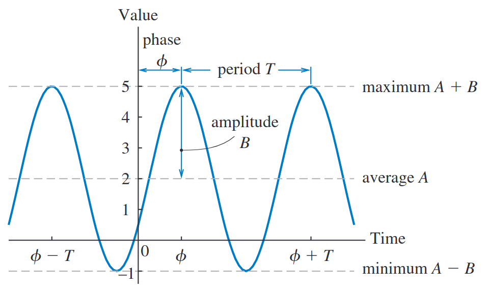]
]

--

.left[
Additionally, we can describe an oscillation according to it's frequency (the inverse of the period), $f=\frac{1}{T}$. Frequency is often measured in _'hertz'_ (number of cycles per second).
]


---

Monthly cycle in women's body temperature

```{r, fig.height=4.3,fig.width=7.8, dev='svg', echo=F, message=F, fig.align='center'}
x <- seq(0,28,length.out=1e3)
par(bg = background_plot, mfrow=c(1,1))
temp <- 36.8 + 0.2*cos((2*pi*(x-16))/28) + 0.3*cos(2*pi*(x-14/24))

plot(x,temp, xlab="time [days]",ylab="temperature [°C]",type="l",col="blue",lwd=3, bty="n", xaxt="n")
abline(h=36.8, lty=2)
axis(1, at=seq(0,28,7))
```

--


$$f(t)=36.8+\underbrace{0.3\cos\left(\frac{2\pi}{1}\left(t-\frac{14}{24}\right)\right)}_{\text{daily oscillation}\\\text{(period } T \text{ and phase } \phi\\ \text{transformed in days)}} +\underbrace{0.2\cos\left(\frac{2\pi}{28}(t-16)\right)}_{\text{monthly oscillation}}$$
---

### Fourier series

.pull-left[
- We can approximate almost any functions by summing many cosine functions with different amplitudes, periods and phases.


- The approximation improves as the number of terms (sinusoidal functions added together) increases

]

.pull-right[
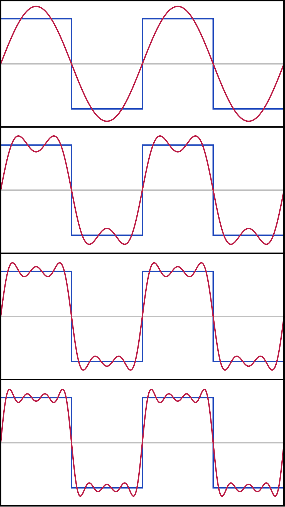
]


---

### Fourier series


.pull-left[
.center[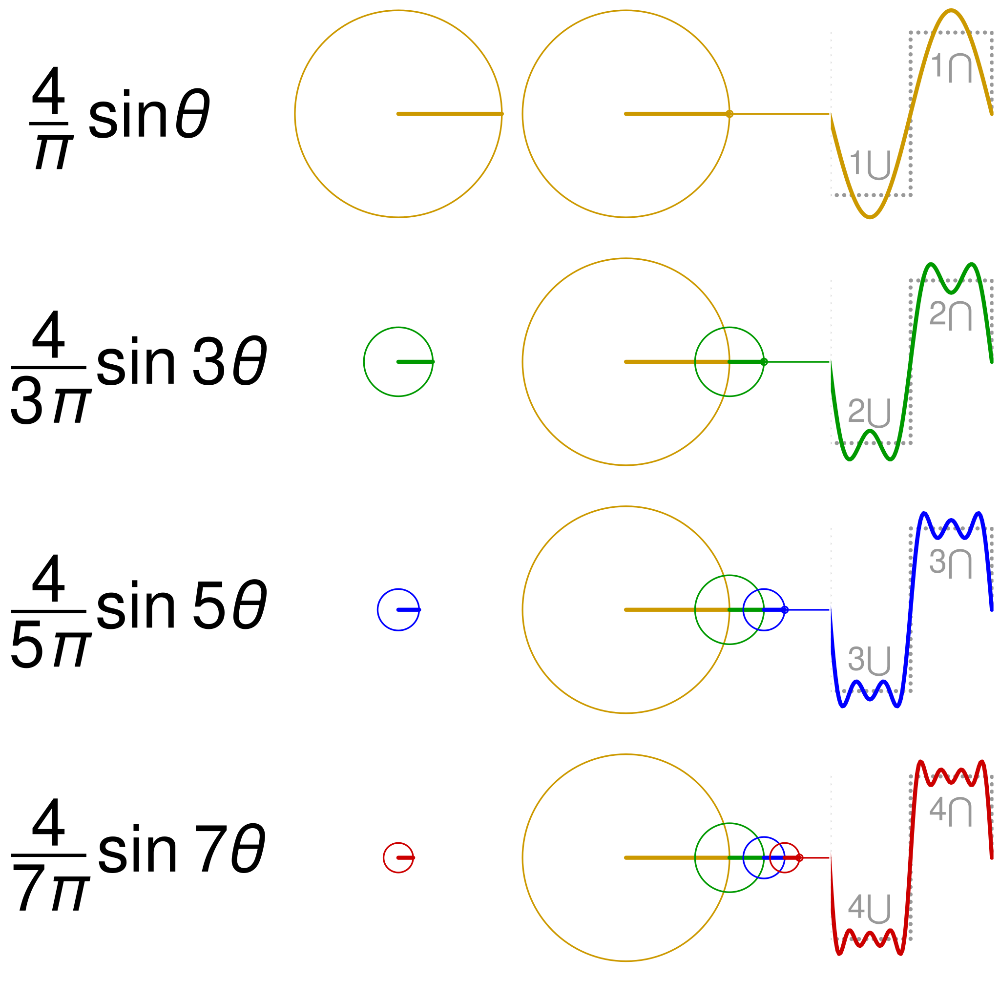]
]

.pull-right[
.center[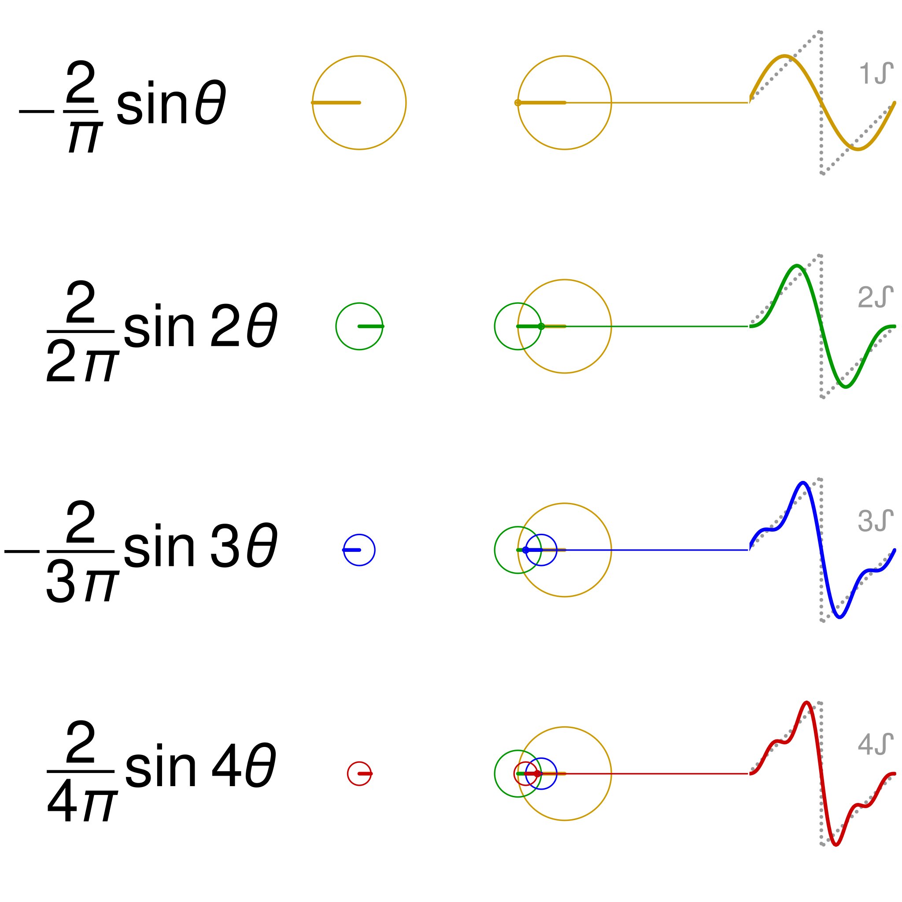]
]


---

### Fourier transform


.center[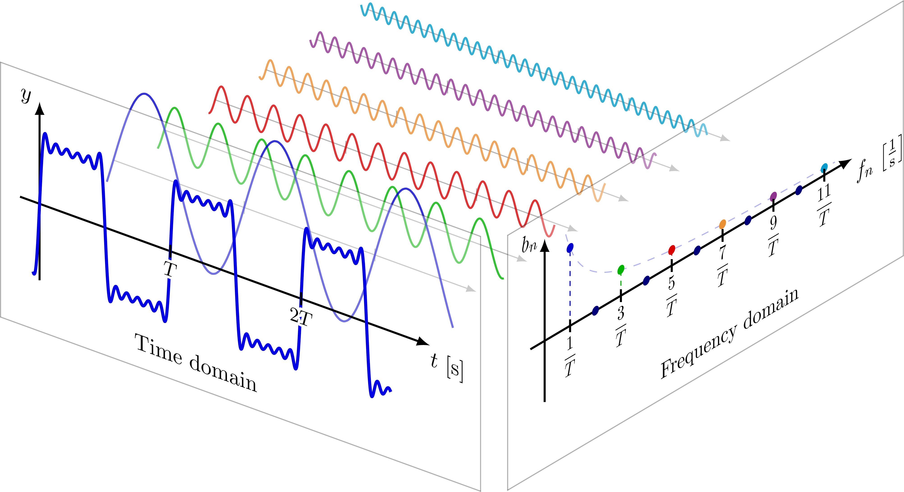]

Fourier transform is a powerful mathematical tool that decompose a function into different frequency components. In the case of a signal that varies over time this corresponding to moving from a representation in the time domain to a frequency domain.


---

### Fourier transform & filtering

.left-column[
- Frequency-domain representation of body temperature signal.

- (hourly measurement, random noise added)


<span style="font-size: 80%;">[(link to code)](https://github.com/mattelisi/NeuroMethods/blob/master/examples/fourier_transform/fourier_transform.m)</span>  

]


.right-column[
.center[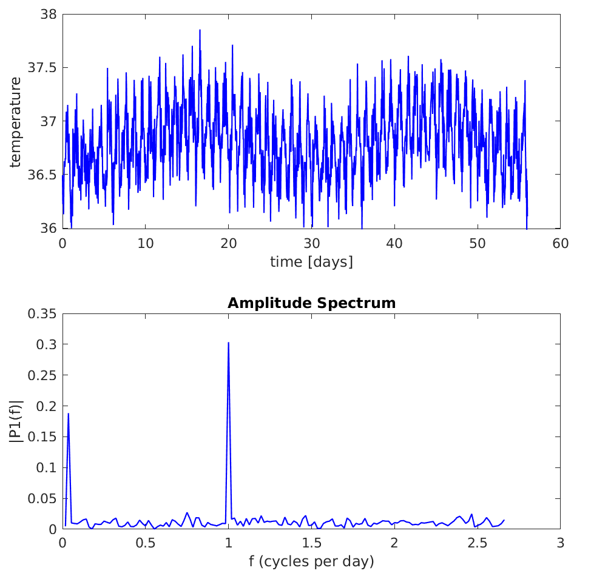]
]


---

### Fourier transform & filtering

- Working on the frequency-domain representation makes it easy to suppress frequencies selectively
--


- Low pass filter (I set to zero everything with a period shorted than 2 days)

.center[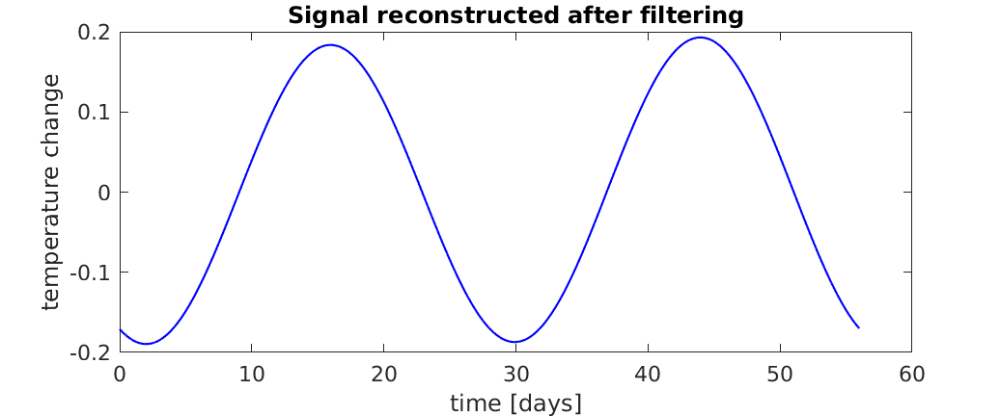]


<!---
Matlab code on GitHub
.center[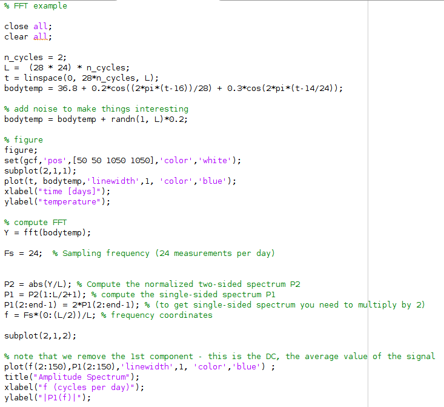]
-->

---

### Continuous & discrete signals

* Continuous functions can be used to describe _continuous_ (analog) signals (e.g. voltage of a EEG electrode)
--

* In practice, most of the time we work with _discrete_ signals - that is sequence of values. that comes from a sampling (or discretization) of a continuous signal. For example: 
  - recording of EEG voltage is stored as a sequence of values;
  - in eyetracking, movements of visual axis are discretized in a sequence of gaze positions.
--

* We can apply similar operations to both types of signals (with some caveat). For example we have the _discrete Fourier transform_ for discrete signals.
--

* Information is lost in the sampling process. If the sampling interval (distance between sampling points) is too coarse, then the continuous signal is not uniquely determined by the samples causing _**aliasing**_ errors.

.center[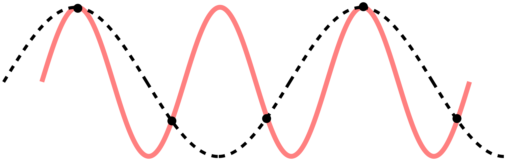]

<!---
The mechanisms underlying this bistable phenomenon (the “continuous wagon wheel illusion”) are heavily debated, but one interpretation suggests that motion information is perceived in discrete episodes at a rate between 10 and 15 Hz. [...] These data are compatible with the idea that motion perception occurs in snapshots <100 ms in duration.
-->


---
class: inverse, center

### Aliasing error in the wild

<video width="384" height="512" controls>
<source src="./img/propeller.mp4" type="video/mp4">
</video>


---

### Application of Fourier transform in two dimensions

.center[]


---
class: inverse
name: summary-part1

### Part 1 summary

**Functions** map inputs to outputs and express relationships between variables (continuous or discrete).  

**Differentiation** captures local rate of change—slopes and tangents; on sampled data we approximate it with finite differences.  

**Exponentials & logs** are opposite operations: they turn products into sums.

**Probability functions** describe uncertainty: densities (continuous, e.g. Normal distribution) vs masses (discrete, e.g. binomial).  

**Trigonometric functions** (sine/cosine) are useful to model oscillatory signals; 

**Fourier transform** moves between time and frequency representations of a signal and enable filtering of signals.


