class: title-slide, center, inverse

# `r rmarkdown::metadata$title`

# `r rmarkdown::metadata$subtitle`

## `r rmarkdown::metadata$author`

### `r rmarkdown::metadata$date`


```{r setup, include=FALSE, fig.showtext=TRUE}

# slides & formatting
options(htmltools.dir.version = FALSE)
options(crayon.enabled = TRUE)

xaringanExtra::use_xaringan_extra(c("tile_view", "animate_css", "tachyons"))

# css: [rladies-fonts, default, custom/style.css]
library(xaringanthemer)
style_solarized_light(colors = c(
  red = "#f34213",
  purple = "#3e2f5b",
  orange = "#ff8811",
  green = "#136f63",
  white = "#FFFFFF",
  blue = " #0000FF"
))

# R stuff
library(ggplot2)
nice_theme <- theme_xaringan()+theme(text=element_text(size=9),panel.border=element_blank(),strip.text=element_text(size=rel(0.8)),axis.text=element_text(size=8),panel.grid.minor=element_blank(),axis.line=element_line(size=.4), axis.title=element_text(size=11), legend.title=element_text(size=11))
theme_set(nice_theme)

background_plot <- nice_theme$plot.background$colour
knitr::opts_knit$set(global.par = TRUE) # fix par for multiple plots

library(tidyverse)
library(kableExtra)

library(grid)   # for arrow()

# to fix the issue of brackets
library(showtext)
showtext_auto(FALSE)
```

---
class: inverse

## Vocabulary

- vector
- matrix
- linear combination
- linear (in)dependence
- basis
- span
- transformation
- eigenvalues & eigenvectors


---
### Vectors

- A list of $n$ numbers representing a point, or an "arrow", in $n$-dimensional space
--

- The vector $\overrightarrow{x} = \begin{bmatrix}  x_1 \\ x_2 \end{bmatrix} \in \mathbb{R}^2$ represents a point/arrow in a 2-dimensional space


<!-- .center[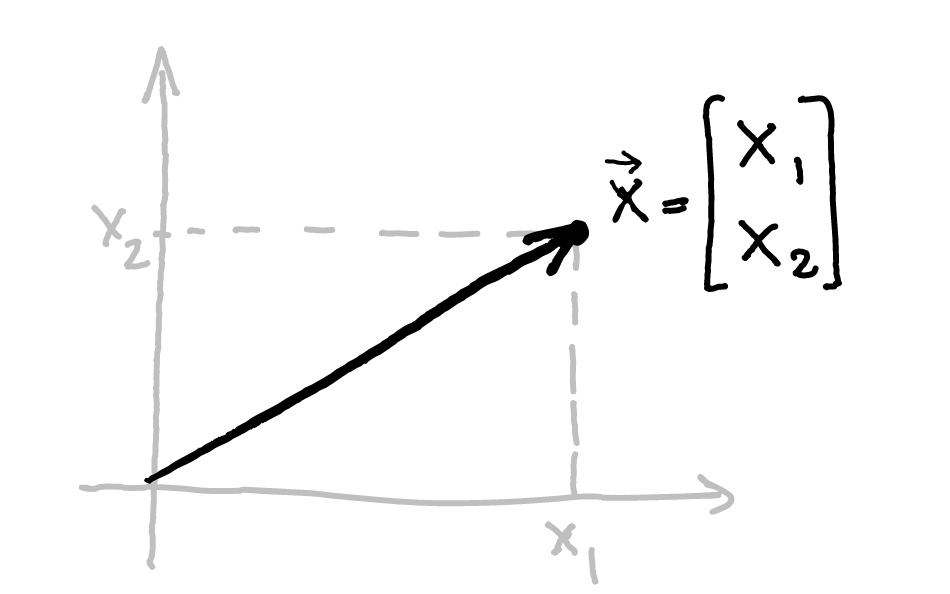] -->

```{r, fig.height=3,fig.width=3, dev='svg', echo=F, message=F, fig.align='center', out.width="40%", warning=FALSE, , fig.showtext=FALSE}
# Define the vector components
x1 <- 3
x2 <- 3

# Create a dataframe for the vector
vector_data <- data.frame(x = c(0, x1), y = c(0, x2))

# Plot the vector
p <- ggplot() +
  geom_segment(data = vector_data, aes(x = -0.5, y = -0.5, xend = x1, yend = x2),
               arrow = arrow(type = "closed", length = unit(0.2, "inches")), linewidth = 1, color="blue") +
  geom_text(aes(x = x1, y = x2,
                label = "bold(x) == bgroup('[',atop(x[1],x[2]),']')"
                ),
            parse = TRUE, hjust = -0.25, vjust = -0.25) +
  geom_line(aes(x = c(x1, x1), y = c(-3, x2)), color = "black", linetype = "dashed") +
  geom_line(aes(x = c(-3, x1), y = c(x2, x2)), color = "black", linetype = "dashed") +
  scale_x_continuous(name = "", breaks = 3, labels=expression(x[1])) +
  scale_y_continuous(name = "", breaks = 3, labels=expression(x[2])) +
  coord_cartesian(xlim=c(0, 4.3), ylim=c(0, 5))+
  theme_minimal() +
  theme(panel.grid.major = element_blank(),
        panel.grid.minor = element_blank(),
        axis.line = element_line(color = "black"),
        axis.text.x = element_text(color = "black"),
        axis.text.y = element_text(color = "black"),
        axis.ticks = element_line(color = "black"),
        plot.background = element_rect(fill = "transparent", color = NA))+ # transparent background+
  nice_theme

# Print the plot
print(p)

```


---
### Vectors


<!-- .center[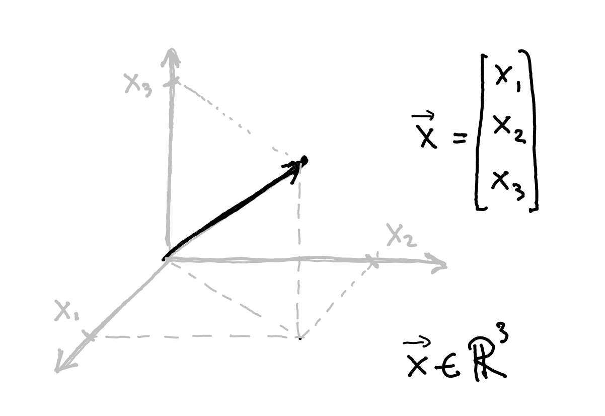] -->

.left-column[

A 3-dimensional vector:

<br><br>

$$\vec{x} = \begin{pmatrix} x_1 \\ x_2 \\ x_3 \end{pmatrix}$$
<br><br>

$$\vec{x} \in \mathbb{R}^3$$

]

.right-column[

```{r echo=F, message=F, warning=FALSE}
library(plotly)

# Define the 3D vector components
x1 <- 3
x2 <- 3
x3 <- 4

# Create 3D plot
fig <- plot_ly() %>%
  # Add the main vector arrow (from origin to point)
  add_trace(
    type = "scatter3d",
    mode = "lines",
    x = c(0, x1), y = c(0, x2), z = c(0, x3),
    line = list(color = "blue", width = 8),
    showlegend = FALSE,
    hoverinfo = "none"
  ) %>%
  # Add cone for arrow head
  add_trace(
    type = "cone",
    x = x1, y = x2, z = x3,
    u = x1/10, v = x2/10, w = x3/10,  # direction
    colorscale = list(c(0, "blue"), c(1, "blue")),
    showscale = FALSE,
    hoverinfo = "none"
  ) %>%
  # Add dashed projection lines
  # Projection to x-y plane (z=0)
  add_trace(
    type = "scatter3d",
    mode = "lines",
    x = c(x1, x1), y = c(x2, x2), z = c(0, x3),
    line = list(color = "gray", width = 2, dash = "dash"),
    showlegend = FALSE,
    hoverinfo = "none"
  ) %>%
  add_trace(
    type = "scatter3d",
    mode = "lines",
    x = c(0, x1), y = c(0, x2), z = c(0, 0),
    line = list(color = "gray", width = 2, dash = "dash"),
    showlegend = FALSE,
    hoverinfo = "none"
  ) %>%
  add_trace(
    type = "scatter3d",
    mode = "lines",
    x = c(0, x1), y = c(0, x2), z = c(x3, x3),
    line = list(color = "gray", width = 2, dash = "dash"),
    showlegend = FALSE,
    hoverinfo = "none"
  ) %>%
  # Projection to x-z plane (y=0)
  add_trace(
    type = "scatter3d",
    mode = "lines",
    x = c(x1, x1), y = c(0, x2), z = c(0, 0),
    line = list(color = "gray", width = 2, dash = "dash"),
    showlegend = FALSE,
    hoverinfo = "none"
  ) %>%
  # Projection to y-z plane (x=0)
  add_trace(
    type = "scatter3d",
    mode = "lines",
    x = c(0, x1), y = c(x2, x2), z = c(0, 0),
    line = list(color = "gray", width = 2, dash = "dash"),
    showlegend = FALSE,
    hoverinfo = "none"
  ) %>%
  # Add axes
  layout(
    scene = list(
      xaxis = list(title = "x₁", range = c(0, 5), showgrid = FALSE, zeroline = TRUE),
      yaxis = list(title = "x₂", range = c(0, 5), showgrid = FALSE, zeroline = TRUE),
      zaxis = list(title = "x₃", range = c(0, 5), showgrid = FALSE, zeroline = TRUE),
      camera = list(
        eye = list(x = 1.5, y = -1.5, z = 1.2)
      ),
      aspectmode = "cube"
    ),
    paper_bgcolor = "rgba(0,0,0,0)",
    plot_bgcolor = "rgba(0,0,0,0)",
    # Set the plot dimensions here
    width = 500,
    height = 500,
    margin = list(l = 0, r = 0, t = 0, b = 0)
  )

htmltools::div(
  style = "display: flex; justify-content: center; align-items: center;",
  fig
)
```

]

---
### Sum of vectors


$$\vec{a} = \begin{bmatrix} 1 \\ 2 \end{bmatrix}
\qquad
\vec{b} = \begin{bmatrix} 3 \\ 1 \end{bmatrix}
\qquad
\overrightarrow{a+b} = \begin{bmatrix} 1+3 \\ 2+1 \end{bmatrix}$$


$$\overrightarrow{a+b} = \overrightarrow{b+a}$$

<!-- .center[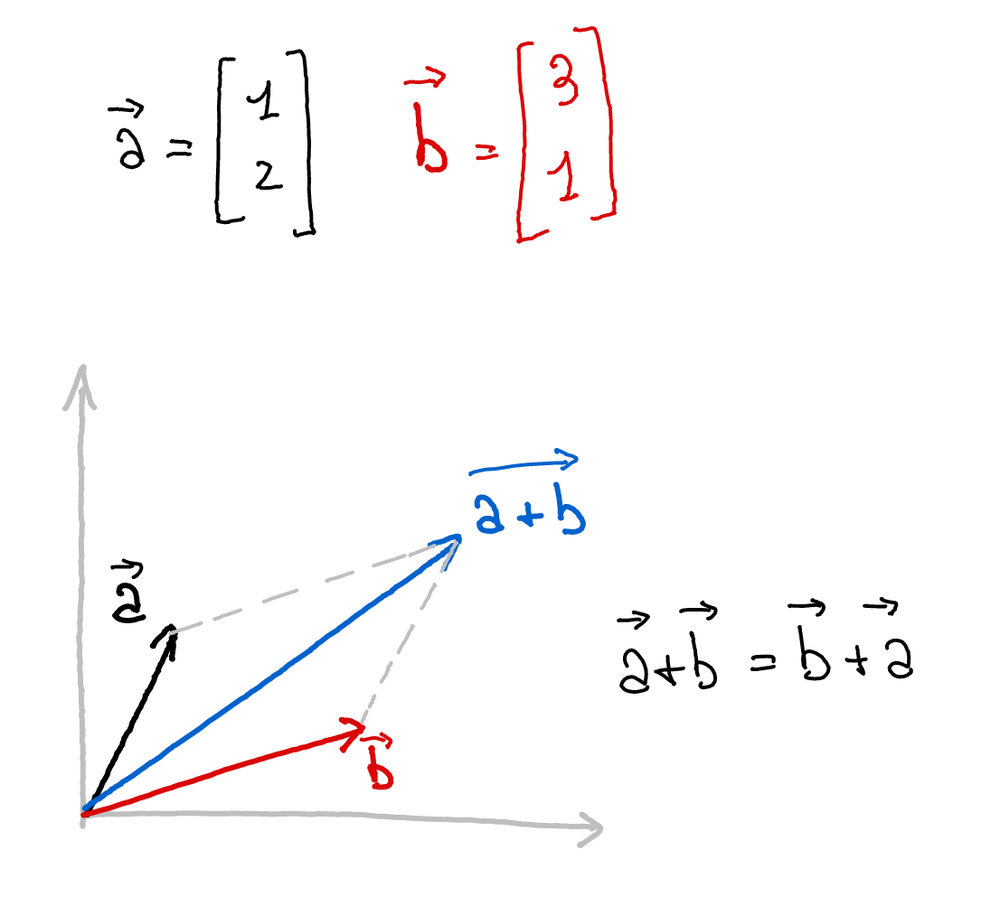] -->

```{r, fig.height=3,fig.width=3, dev='svg', echo=F, message=F, fig.align='center', out.width="40%", warning=FALSE, , fig.showtext=FALSE}
# ---- setup (device/font tips for xaringan) ----
# knitr::opts_chunk$set(dev = "png", dev.args = list(type = "cairo"))
# showtext::showtext_auto(FALSE)


# vectors
a <- c(1, 2)
b <- c(3, 1)
s <- a + b

# axis limits
xlim <- c(0, 4.6)
ylim <- c(0, 4.0)


p <- ggplot() +
  
  # dashed parallelogram edges
  geom_segment(aes(x = a[1], y = a[2], xend = s[1], yend = s[2]),
               linetype = "dashed", color = "red3") +
  geom_segment(aes(x = b[1], y = b[2], xend = s[1], yend = s[2]),
               linetype = "dashed", color = "black") +

  # labels near vectors (vector arrows via plotmath: vec(a), vec(b), vec(a)+vec(b))
  annotate("text", x = a[1], y = 1.1*a[2],
           label = "bold(a)", parse = TRUE, color = "black", size = 4) +
  annotate("text", x = 1.1*b[1], y = b[2],
           label = "bold(b)", parse = TRUE, color = "red3", size = 4) +
  annotate("text", x = s[1], y = 1.1*s[2],
           label = "bold(a)+bold(b)", parse = TRUE, color = "blue", size = 4) +

  # vectors from origin
  geom_segment(aes(x = 0, y = 0, xend = a[1], yend = a[2]),
               arrow = arrow(type = "closed", length = unit(0.18, "in")),
               linewidth = 1.2, color = "black") +
  geom_segment(aes(x = 0, y = 0, xend = b[1], yend = b[2]),
               arrow = arrow(type = "closed", length = unit(0.18, "in")),
               linewidth = 1.2, color = "red3") +
  geom_segment(aes(x = 0, y = 0, xend = s[1], yend = s[2]),
               arrow = arrow(type = "closed", length = unit(0.18, "in")),
               linewidth = 1.3, color = "blue") +

  
  labs(x=expression(x[1]), y=expression(x[2]))+
  coord_cartesian(xlim = c(0, 4.6), ylim = c(0, 4.0)) +
  theme_minimal() +
  theme(
    panel.grid.major = element_blank(),
    panel.grid.minor = element_blank(),
    axis.title = element_blank(),
    axis.text  = element_blank(),
    axis.ticks = element_blank(),
    axis.line  = element_line(color = "black"),
    plot.background = element_rect(fill = "transparent", color = NA)
  ) +
  nice_theme
p


```


---
#### Multiplication of a vector with a single number (_scalar_)


<!-- .center[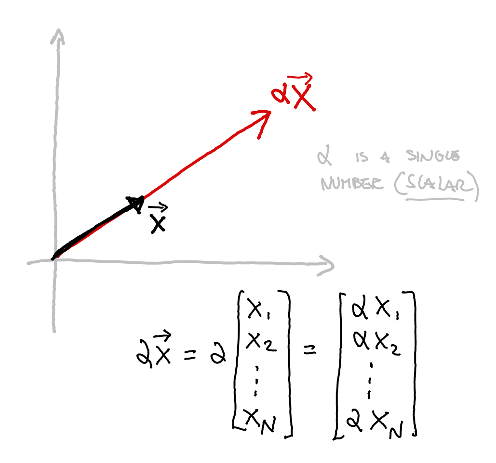] -->


```{r, fig.height=3,fig.width=3, dev='svg', echo=F, message=F, fig.align='center', out.width="40%", warning=FALSE, , fig.showtext=FALSE}
# ---- setup (device/font tips for xaringan) ----
# knitr::opts_chunk$set(dev = "png", dev.args = list(type = "cairo"))
# showtext::showtext_auto(FALSE)


# ---- parameters ----
x1 <- 1.2
x2 <- 1.0
alpha <- 2        # scalar multiplier

# endpoints
x  <- c(x1, x2)
ax <- alpha * x

# plot
p <- ggplot() +

  # vector alpha * x (red)
  geom_segment(aes(x = 0, y = 0, xend = ax[1], yend = ax[2]),
               arrow = arrow(type = "closed", length = unit(0.18, "in")),
               linewidth = 1.3, color = "red3") +
  annotate("text", x = ax[1], y = ax[2] + 0.2,
           label = "alpha*bold(x)", parse = TRUE, size = 4, color = "red3") +
  
  # vector x (black)
  geom_segment(aes(x = 0, y = 0, xend = x[1], yend = x[2]),
               arrow = arrow(type = "closed", length = unit(0.18, "in")),
               linewidth = 1.2, color = "black") +
  annotate("text", x =  x[1]-0.1, y = x[2]+0.2,
           label = "bold(x)", parse = TRUE, size = 4, color = "black") +


  # optional note on the right (comment out if not needed)
  annotate("text", x = 0.2, y = 2.8,
           label = "α is a single number (scalar)",
           hjust = 0, color = "grey30") +

  labs(x=expression(x[1]), y=expression(x[2]))+
  coord_cartesian(xlim = c(0, 4.6), ylim = c(0, 3.6)) +
  theme_minimal() +
  theme(
    panel.grid.major = element_blank(),
    panel.grid.minor = element_blank(),
    axis.title = element_blank(),
    axis.text  = element_blank(),
    axis.ticks = element_blank(),
    axis.line  = element_line(color = "black"),
    plot.background = element_rect(fill = "transparent", color = NA)
  ) +
  nice_theme

p


```

$$\alpha \,\vec{x}
= \alpha
\begin{bmatrix}
x_1 \\ x_2 \\ \vdots \\ x_N
\end{bmatrix}
=
\begin{bmatrix}
\alpha x_1 \\ \alpha x_2 \\ \vdots \\ \alpha x_N
\end{bmatrix}$$

---
#### Elementwise vector multiplication (Hadamard product)


<!-- .center[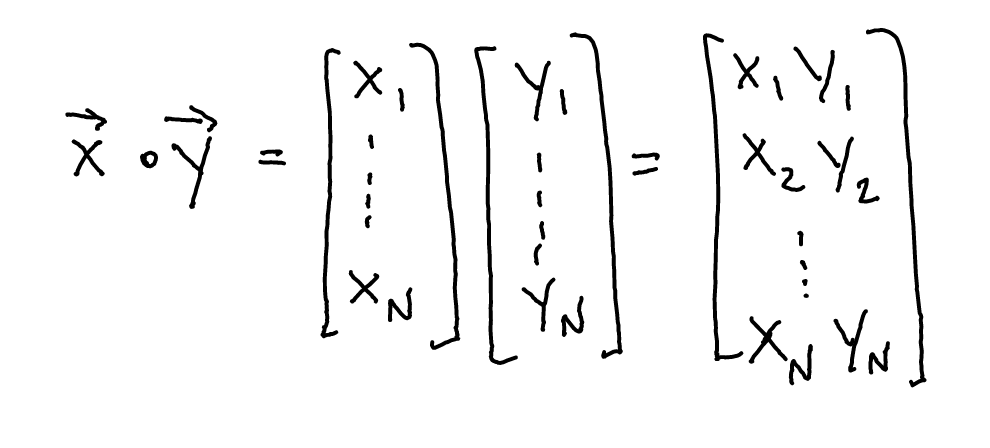] -->
$$\vec{x} \circ \vec{y} = \begin{bmatrix}
x_1 \\
\vdots \\
x_n
\end{bmatrix} \circ \begin{bmatrix}
y_1 \\
\vdots \\
y_n
\end{bmatrix} = \begin{bmatrix}
x_1y_1 \\
\vdots \\
x_ny_n
\end{bmatrix}$$


--

In Matlab, you can achieve this with `x .* y`


---
### Linear combination of vectors


<!-- .center[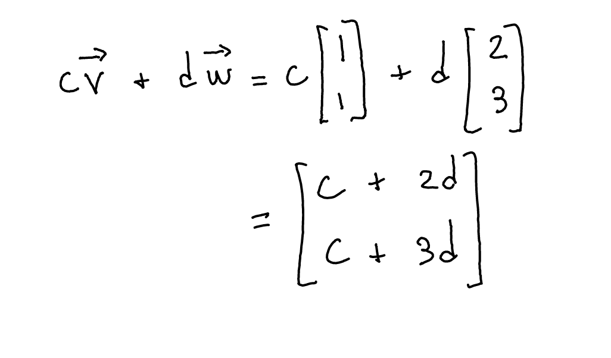] -->

$$c\,\vec{\bf{v}} + d\, \vec{\bf{w}} = c \begin{bmatrix} 1 \\ 1 \end{bmatrix} + d \begin{bmatrix} 2 \\ 3 \end{bmatrix} 
= \begin{bmatrix} c + 2d \\ c + 3d \end{bmatrix}$$


--

.red[_How do you describe the set of **all** possible combinations of] $\overrightarrow{v}$ .red[and] $\overrightarrow{w}$.red[?_]

--

This is referred to as the **span** of the set of vectors $\left\{\overrightarrow{v}, \overrightarrow{w}\right\}$. 

In this case the combinations of $\overrightarrow{v}$ and $\overrightarrow{w}$ fill a whole two-dimensional plane.


---
### Matrix-vector multiplication

Multiplying a matrix by a vector is like taking linear combinations of the matrix's columns

<!-- .center[] -->

$$c\vec{v} + d\vec{w} = c \begin{bmatrix} 1 \\ 1 \end{bmatrix} + d \begin{bmatrix} 2 \\ 3 \end{bmatrix} = \begin{bmatrix} c + 2d \\ c + 3d \end{bmatrix}$$


--

<!-- .center[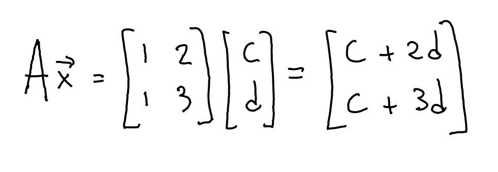] -->

$$\mathbf{A}\vec{x} = \begin{bmatrix}
1 & 2 \\
1 & 3
\end{bmatrix} \begin{bmatrix}
c \\
d
\end{bmatrix} = \begin{bmatrix}
c + 2d \\
c + 3d
\end{bmatrix}$$

---
class: inverse

### Linear models

--

The dependent variable $y$ is modeled as a weighted combination of the predictor variables, plus an additive error $\epsilon$ 
$$y_i=\beta_0 + \beta_1x_{1i} + \ldots +\beta_nx_{ni} + \epsilon_i \\
\epsilon \sim \mathcal{N}\left( 0, \sigma^2 \right)$$

---
class: inverse
count: false

### Linear models


The dependent variable $y$ is modeled as a weighted combination of the predictor variables, plus an additive error $\epsilon$ 
$$\textbf{Y} = \textbf{X}\beta + \epsilon \\
\epsilon \sim \mathcal{N}\left( 0, \sigma^2 \right)$$

--

Linear models: matrix notation

$$\bf{Y} = \bf{X}\beta + \epsilon$$
$$\left( \begin{array}{c} y_1 \\ \vdots \\ y_m \end{array} \right) =
\left( \begin{array}{cccc} 
1 & x_{11} & \ldots & x_{1n}\\ 
\vdots & \vdots & \ddots & \vdots\\ 
1 & x_{m1} & \ldots & x_{mn}
\end{array} \right)
\left( \begin{array}{c} \beta_0 \\  \beta_1 \\ \vdots \\ \beta_n \end{array} \right) +
\left( \begin{array}{c} \epsilon_1 \\ \vdots \\ \epsilon_m \end{array} \right)$$

<!-- Matrix multiplication:  -->
<!-- $$ -->
<!-- \left( \begin{array}{cc} a & b \\ c& d \end{array} \right)  -->
<!-- \left( \begin{array}{c} 1 \\ 2 \end{array} \right) =  -->
<!-- 1 \left( \begin{array}{c} a \\ c \end{array} \right) +  -->
<!-- 2 \left( \begin{array}{c} b \\ d \end{array} \right) = -->
<!-- \left( \begin{array}{c} a + 2b \\ c+ 2d \end{array} \right) -->
<!-- $$ -->


---
### Linear independence

<!-- .center[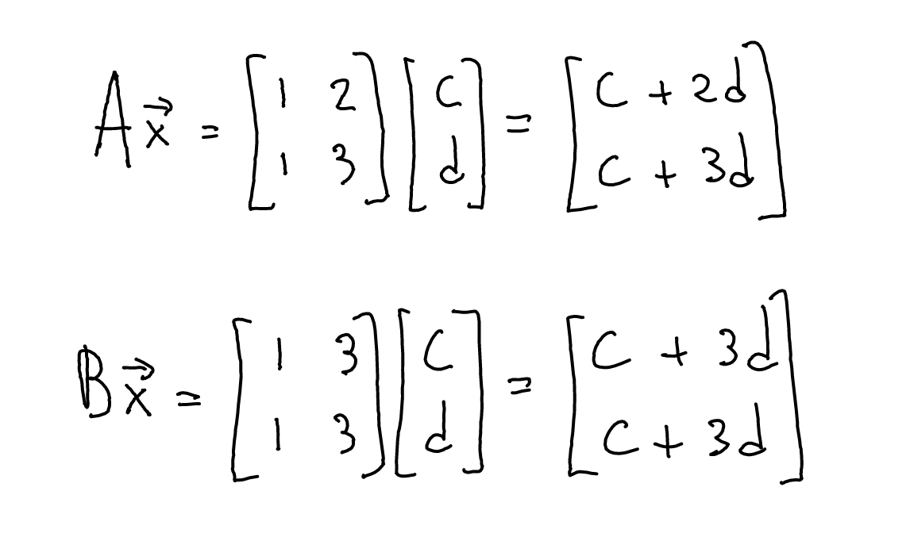] -->

$$\mathbf{A}\vec{x} = \begin{bmatrix}
1 & 2 \\
1 & 3
\end{bmatrix} \begin{bmatrix}
c \\
d
\end{bmatrix} = \begin{bmatrix}
c + 2d \\
c + 3d
\end{bmatrix}$$

$$\mathbf{B}\vec{x} = \begin{bmatrix}
1 & 3 \\
1 & 3
\end{bmatrix} \begin{bmatrix}
c \\
d
\end{bmatrix} = \begin{bmatrix}
c + 3d \\
c + 3d
\end{bmatrix}$$


.red[_How does the _span_ of the columns of A differ from the span of the columns of B?_] 

--

A set of vector is said to be _linearly independent_ if no vector in the set that is equal to a linear combination of the others.

---
### Vector dot product

.center[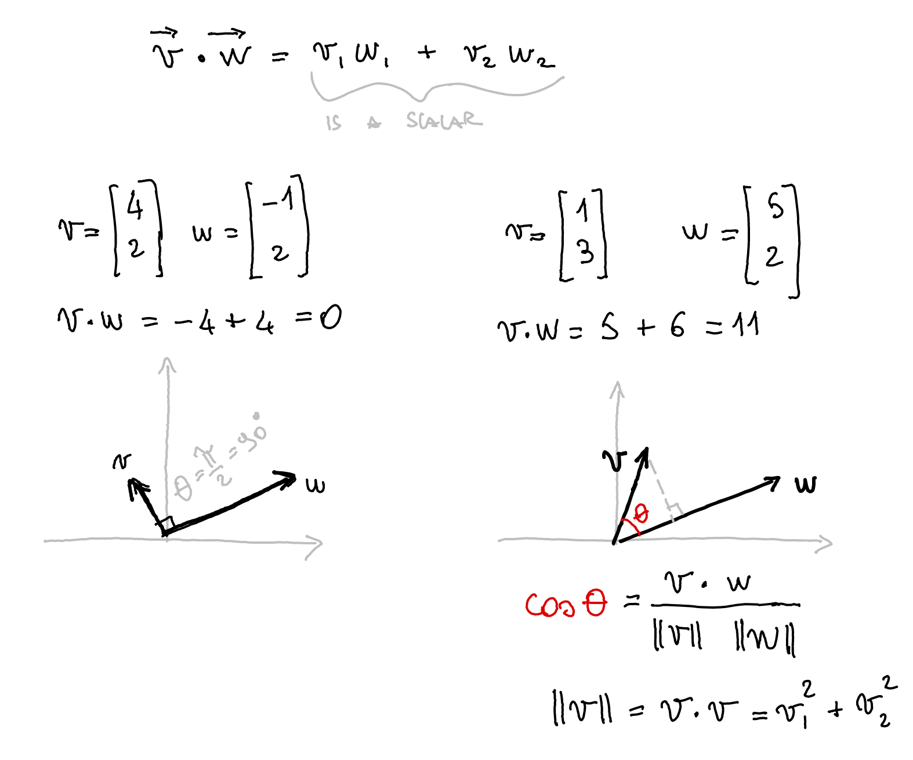]


---
### Vector dot product

.center[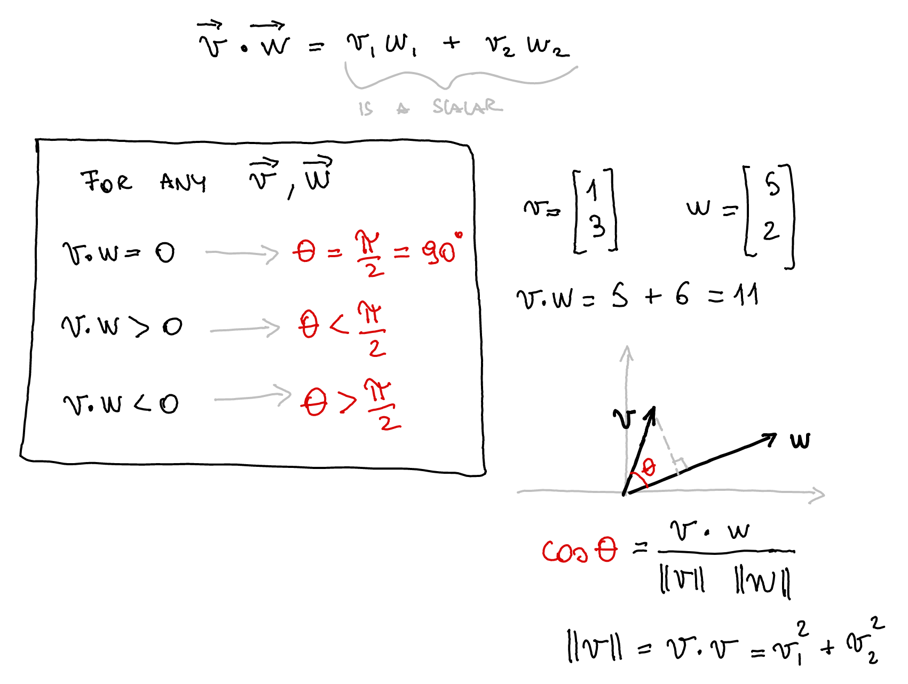]


---
class:inverse
### Matrix multiplication

* How do we multiply two matrices?
--


* While there is only one correct way of doing it, we can about it in 2 slightly different ways:
--


  1. as a series of dot products;
--

  
  1. as a "combination of combinations" of columns.


--

* This is the default operatin for the symbol `*` in Matlab.


---
### Matrix multiplication

.center[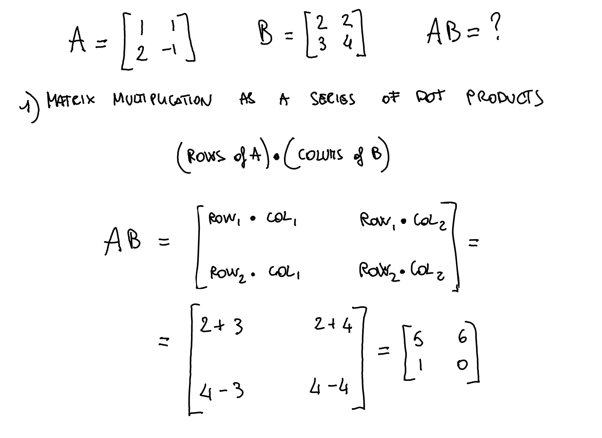]


---
### Matrix multiplication

.center[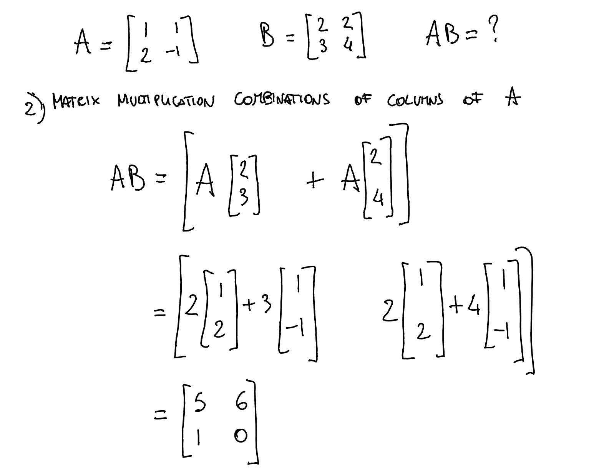]


---
### Matrix multiplication

.center[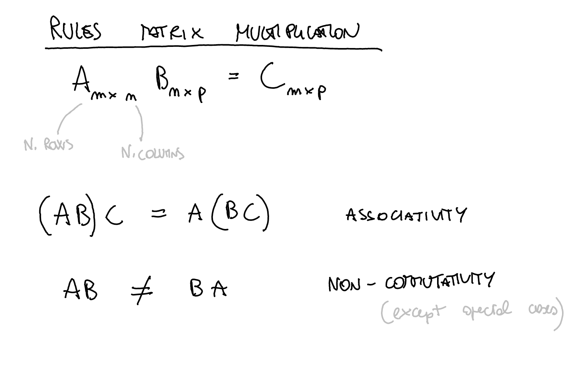]


---
class: inverse

### Neural networks

.center[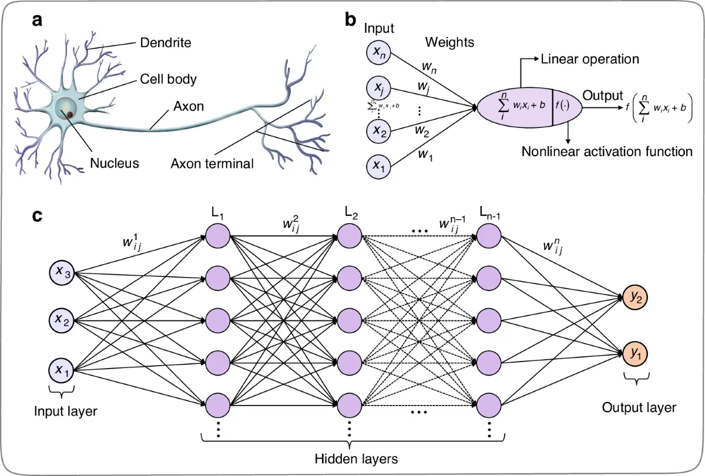]


---
class: inverse
count: false

### Neural networks

.pull-left[

.center[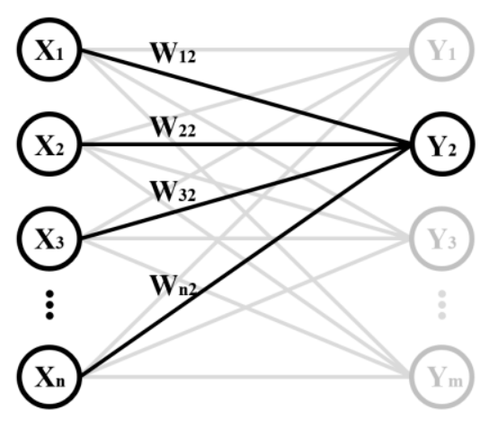]

]

.pull-right[

Suppose we have $n$ units $\mathbf{X}_{1\times n} = \left(x_1, \ldots, x_n \right)$ projecting to $m$ units in the next layer $\mathbf{Y}_{1\times m} = \left(y_1, \ldots, y_m \right)$. 


We can arrange our weights into a matrix $\mathbf{W}_{n \times m}$ and compute all weighted sum at once using matrix multiplication:

$$\mathbf{X}_{1\times n}\,\mathbf{W}_{n\times m} = \mathbf{Y}_{1\times m}$$

<!-- $$\begin{aligned} -->
<!-- \mathbf{X}_{1\times n}\,\mathbf{W}_{n\times m} &= \mathbf{Y}_{1\times m}\\[4pt] -->
<!-- (x_1,\ldots,x_n)\! -->
<!-- \begin{pmatrix} -->
<!-- w_{1,1} & \cdots & w_{1,m}\\ -->
<!-- \vdots  & \ddots & \vdots\\ -->
<!-- w_{n,1} & \cdots & w_{n,m} -->
<!-- \end{pmatrix} &= (y_1,\ldots,y_m)  -->
<!-- \end{aligned}$$ -->

]


---
class: inverse
count: false

### Neural networks

$$\begin{aligned}
\mathbf{X}_{1\times n}\,\mathbf{W}_{n\times m} &= \mathbf{Y}_{1\times m}\\[16pt]
(x_1,\ldots,x_n)\!
\begin{pmatrix}
w_{1,1} & \cdots & w_{1,m}\\
\vdots  & \ddots & \vdots\\
w_{n,1} & \cdots & w_{n,m}
\end{pmatrix} &=   (y_1,\ldots,y_m) \\[16pt]
\Biggl[  \underbrace{ (x_1,\ldots,x_n) \begin{pmatrix}
w_{1,1} \\
\vdots  \\
w_{n,1} \end{pmatrix}}_{\text{the dot product between }\mathbf{X}_{1\times n}\\ \text{and 1st column of }\mathbf{W}_{n\times m}\\ \text{gives } y_1}\, , \quad \ldots , \quad (x_1,\ldots,x_n) \begin{pmatrix}
w_{1,m} \\
\vdots  \\
w_{n,m} \end{pmatrix} \Biggr]&= (y_1,\ldots,y_m)
\end{aligned}$$

---
### Matrices as _linear transformations_ of vectors

We can think of matrices as functions, which takes vectors as input and apply _transformations_ to them. 

$$\overrightarrow{y} = f(\overrightarrow{x}) = A \overrightarrow{x}$$

---
### Example: 'stretch' transformation

.left-column[

$S = \begin{bmatrix}  1+\delta &  0 \\ 0  & 1\end{bmatrix}$

$S \begin{bmatrix}  x_1 & x_2 & \ldots \\ y_1 & y_2 & \ldots \end{bmatrix} = ?$

]


.right-column[
```{r, fig.height=4,fig.width=8, dev='svg', echo=F, message=F, fig.align='center', out.width="80%"}
set.seed(2)
x <- runif(50, min=-1, max=1)
y <- runif(50, min=-1, max=1)

delta <- 0.7
S <- matrix(c(1+delta, 0, 0, 1), nrow=2, ncol=2)

end_dots <- S %*% rbind(x,y)

par(lwd=1,mar=(c(3, 3, 2, 2) + 0.1),mgp=c(1.7,0.5,0),bg = background_plot)
plot(end_dots[1,], end_dots[2,], xlab=" ",ylab=" ",pch=19,cex.lab=1.2,cex=0,col="white",axes=F)
axis(1)
axis(2)
abline(v=0,lty=2)
points(x,y, pch=19)
#arrows(x, y,end_dots[1,], end_dots[2,], length=0.1)
```
]


---
### Example: 'stretch' transformation

.left-column[

$S = \begin{bmatrix}  1+\delta &  0 \\ 0  & 1\end{bmatrix}$


<!-- .center[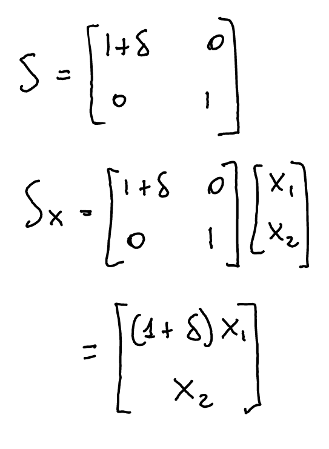] -->

$\begin{align*} S &= \begin{bmatrix} 1 + \delta & 0 \\ 0 & 1 \end{bmatrix} \\ S\vec{x} &= \begin{bmatrix} 1 + \delta & 0 \\ 0 & 1 \end{bmatrix} \begin{bmatrix} x_1 \\ x_2 \end{bmatrix} \\ &= \begin{bmatrix} (1 + \delta)x_1 \\ x_2 \end{bmatrix} \end{align*}$

]

.right-column[
```{r, fig.height=4,fig.width=8, dev='svg', echo=F, message=F, fig.align='center', out.width="80%"}
par(lwd=1,mar=(c(3, 3, 2, 2) + 0.1),mgp=c(1.7,0.5,0),bg = background_plot)
plot(end_dots[1,], end_dots[2,], xlab=" ",ylab=" ",pch=19,cex.lab=1.2,cex=1.8,col="blue",axes=F)
axis(1)
axis(2)
abline(v=0,lty=2)
points(x,y, pch=19)
arrows(x, y,end_dots[1,], end_dots[2,], length=0.1)
```
]


---
class:inverse
### Special matrices

Identity matrix: $I = \begin{bmatrix}  1 &  0 \\ 0  & 1\end{bmatrix}$

For any other matrix $A$ we have that $AI = A = IA$


---
class:inverse
### Special matrices

Inverse matrix: $A^{-1}A=AA^{-1}=I$

--

$S = \begin{bmatrix}  1+\delta &  0 \\ 0  & 1\end{bmatrix}$ has inverse $S^{-1} = \begin{bmatrix}  \frac{1}{1+\delta} &  0 \\ 0  & 1\end{bmatrix}$ 

--

$SS^{-1} = \begin{bmatrix}  1+\delta &  0 \\ 0  & 1\end{bmatrix} \begin{bmatrix}  \frac{1}{1+\delta} &  0 \\ 0  & 1\end{bmatrix} = \begin{bmatrix}  \frac{1+\delta}{1+\delta} &  0 \\ 0  & 1\end{bmatrix} = \begin{bmatrix}  1 &  0 \\ 0  & 1\end{bmatrix} = I$


---
### Eigenvalues & Eigenvectors


.center[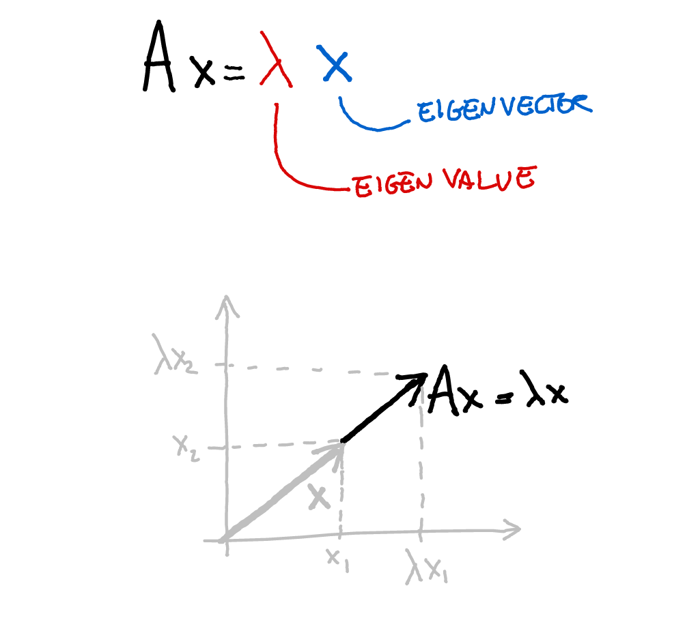]


---
### Eigenvalues & Eigenvectors


.center[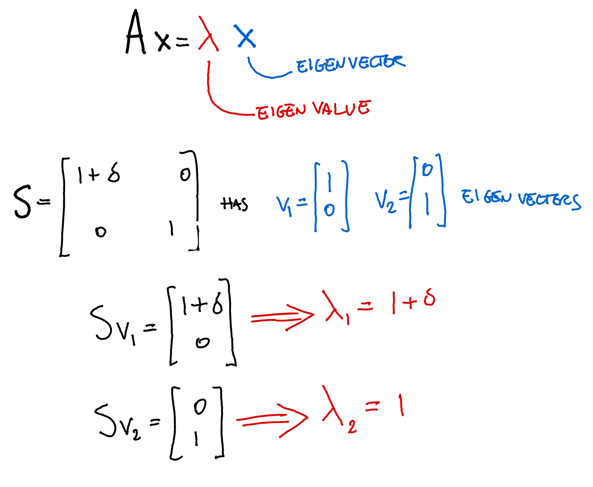]


---

$Sv_1 = \begin{bmatrix}  1+\delta &  0 \\ 0  & 1\end{bmatrix} \begin{bmatrix}  1 \\  0\end{bmatrix} = \begin{bmatrix}  1+\delta \\  0\end{bmatrix} =  (1+\delta ) \begin{bmatrix}  1\\  0\end{bmatrix}= \lambda_1 v_1$

$Sv_2 = \begin{bmatrix}  1+\delta &  0 \\ 0  & 1\end{bmatrix} \begin{bmatrix}  0 \\  1\end{bmatrix} = \begin{bmatrix}  0 \\  1\end{bmatrix} =  1 \begin{bmatrix}  0\\  1\end{bmatrix}= \lambda_2 v_2$


```{r, fig.height=4,fig.width=8, dev='svg', echo=F, message=F, fig.align='center'}
par(lwd=1,mar=(c(3, 3, 2, 2) + 0.1),mgp=c(1.7,0.5,0),bg = background_plot)
plot(end_dots[1,], end_dots[2,], xlab=" ",ylab=" ",pch=19,cex.lab=1.2,cex=1.8,col=rgb(0,0,1,0.2), xlim=c(-2,2.1), ylim=c(-1.4,1.4),axes=F)
axis(1)
axis(2)
abline(v=0,lty=2)
points(x,y, pch=19, col=rgb(0,0,0,0.2))
arrows(x, y,end_dots[1,], end_dots[2,], length=0.1, col=rgb(0,0,0,0.2))

arrows(0, 0,1+delta, 0, lwd=10, length=0.3,col="blue")
arrows(0, 0,1, 0, lwd=10, length=0.3)
arrows(0, 0,0, 1, lwd=10, length=0.3)

text(0,1,labels=expression(Sv[2]==v[2]), pos=3, cex=2)
text(1,0,labels=expression(v[1]), pos=3, cex=2, offset=1.8)
text(1+delta,0,labels=expression(Sv[1]==lambda~v[1]), pos=1, cex=2, col="blue", offset=1.8)

```


---
class:inverse
### Principal component analysis (PCA)

* A _dimensionality-reduction_ method
--


* Given $n$-dimensional vectors (e.g. recording from $n$ neurons) as data, we obtain a lower-dimensional representation, by projecting the data on a set of _principal components_, while preserving as much of the data's variation as possible.
--

* Variance-covariance matrix: 
$\Sigma  = \begin{bmatrix}  \text{Var}(x_1) &  \text{Cov}(x_1,x_2) & \cdots & \text{Cov}(x_1,x_n) \\ \text{Cov}(x_2,x_1) &\text{Var}(x_2) & \cdots & \text{Cov}(x_2,x_n)\\ \vdots & \vdots &  \ddots & \vdots \\  \text{Cov}(x_n,x_1)  & \text{Cov}(x_n,x_2)  & \cdots & \text{Var}(x_n) \end{bmatrix}$
--


* The eigenvectors of the variance-covariance are the principal components.
--


* The eigenvector with the largest eigenvalue represents the direction of maximal variation in the data.


---
### Principal component analysis (PCA)

$\Sigma = \begin{bmatrix}  1 &  0.99 \\ 0.99  & 1.5\end{bmatrix}$

```{r, fig.height=5,fig.width=5, dev='svg', echo=F, message=F, fig.align='center'}
set.seed(2)
Sigma <- matrix(c(1,0.7*sqrt(2),0.7*sqrt(2),1.5),nrow=2, ncol=2)
xy <- MASS::mvrnorm(250, mu=c(0,0),Sigma)

par(pty="s",bg = background_plot)
plot(xy[,1], xy[,2],axes=F,xlab=expression(x[1]),ylab=expression(x[2]))
axis(1)
axis(2)

m <- matrix(c(cov(xy[,1], xy[,1]), cov(xy[,1], xy[,2]), cov(xy[,2], xy[,1]),cov(xy[,2], xy[,2])),
            nrow=2,
            ncol=2,
            byrow=TRUE,
            dimnames=list(c("x","y"),c("x","y")))

PC <- eigen(m)

abline(h=0,lty=2)
abline(v=0,lty=2)

arrows(0, 0,PC$vectors[1,1], PC$vectors[2,1], lwd=5, length=0.1, col="blue")
arrows(0, 0,PC$vectors[1,2], PC$vectors[2,2], lwd=5, length=0.1, col="red")

legend("bottomright",c(expression(v[1]),expression(v[2])),lwd=5, col=c("blue","red"),bty="n")
```


---
### Principal component analysis (PCA)

Now showing the eigenvectors scaled by their respective eigenvalues.

$$\,$$

```{r, fig.height=5,fig.width=5, dev='svg', echo=F, message=F, fig.align='center'}
set.seed(2)
Sigma <- matrix(c(1,0.7*sqrt(2),0.7*sqrt(2),1.5),nrow=2, ncol=2)
xy <- MASS::mvrnorm(250, mu=c(0,0),Sigma)

par(pty="s",bg = background_plot)
plot(xy[,1], xy[,2],axes=F,xlab=expression(x[1]),ylab=expression(x[2]))
axis(1)
axis(2)

m <- matrix(c(cov(xy[,1], xy[,1]), cov(xy[,1], xy[,2]), cov(xy[,2], xy[,1]),cov(xy[,2], xy[,2])),
            nrow=2,
            ncol=2,
            byrow=TRUE,
            dimnames=list(c("x","y"),c("x","y")))

PC <- eigen(m)

abline(h=0,lty=2)
abline(v=0,lty=2)

arrows(0, 0,PC$vectors[1,1]*PC$values[1], PC$vectors[2,1]*PC$values[1], lwd=5, length=0.1, col="blue")
arrows(0, 0,PC$vectors[1,2]*PC$values[2], PC$vectors[2,2]*PC$values[2], lwd=5, length=0.1, col="red")

legend("bottomright",c(expression(lambda[1]~v[1]),expression(lambda[2]~v[2])),lwd=5, col=c("blue","red"),bty="n")
```


---
class:inverse
Matlab code for PCA on [Github](https://github.com/mattelisi/NeuroMethods)

.center[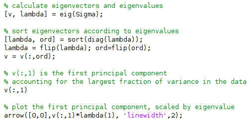]


---
class: inverse
name: summary-part1

### Part 2 summary


**Vectors** represent points/directions in space; **matrices** can be seen as functions that transform them.  

**Linear combinations** of vectors can create new vectors from old ones; **span** is the space of possible combinations; **linear (in)dependence** tells us when vector carry redundant information.  

**Matrix–vector multiplication** is a linear combination of the matrix columns; **dot products** connect algebra and geometry (gives angular distances between vector orientations); and **matrix multiplication** can be seens as "combination of combinations" of columns or a sequence of dot products.

**Eigenvectors** are vectors which are fixed in direction under a given linear transformation (a matrix); the scaling factor of these eigenvectors is then called the **eigenvalue**. (Roughly the eigenvalue is a measure of the distortion induced by the transformation and the eigenvectors tell you about how the distortion is oriented.)

**PCA** uses eigen-decomposition to find directions of maximal variance for constructing a simpler, interpretable representations.


