## Outline part 1


| A mathematical tool | A question it helps us ask |
|:---|:---|
| **Function** $y=f(x)$ | How are two quantities related? |
| **Derivative** $dy/dt$ | How quickly does something change? |
| **Fourier transform** | Which rhythms are present? |


## A function maps an input to an output

$$x\quad\longrightarrow\quad f(x)\quad\longrightarrow\quad y$$

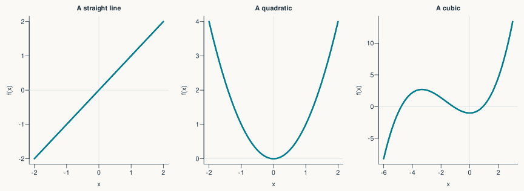{height=365 fig-alt="Three graphs: a straight line, a U-shaped quadratic and a cubic curve. Each gives one output for each input."}

$$f(x)=x \qquad f(x)=x^2 \qquad f(x)=\tfrac15x^3+x^2-1$$

::: {.notes}
Allow 2 minutes. Read the horizontal coordinate first, then move up to the curve and across to the vertical coordinate. A function is a rule, not necessarily a smooth curve. The three formulas are examples, not a list to memorise. Ask what f(2) is for the first two: 2 and 4. A curve can have the same output for several inputs without ceasing to be a function.
:::

## Function notation (example: exponential decay)

$$\underbrace{V(t)}_{\text{voltage at time }t}
=\underbrace{V_0}_{\text{starting value}}
\,e^{-t/\tau}$$

| Symbol | Read it as |
|:---|:---|
| $t$ | Input: elapsed time |
| $V(t)$ | Output: voltage relative to baseline |
| $V_0,\ \tau$ | Parameters: values that set the curve's shape |

::: {.takeaway}
Check the units: $t$ and $\tau$ must use the same time unit.
:::

::: {.notes}
Say “V of t”, not “V times t”. This is an illustrative decay model for a deviation from a baseline. e.g. a discharging capacitor: imagine a capacitor (a component that stores electrical charge) connected to a resistor; initially, the capacitor is charged to a voltage V_0, say 10 volts. Once connected to the resistor, it gradually discharges. A parameter (V_0) is held fixed while we trace a particular curve; changing it gives a different curve. The exponent must be dimensionless. Briefly mention that f(x,t) has two inputs, without adding multivariable calculus.
:::

## Exponentials describe growth and decay

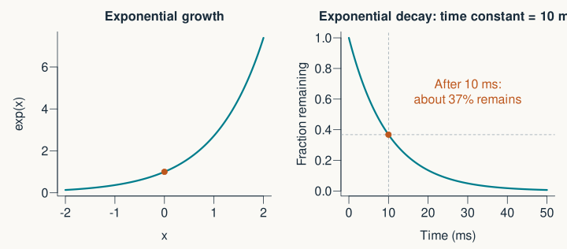{height=405 fig-alt="An increasing exponential on the left and a decaying exponential on the right. A time constant of 10 milliseconds leaves about 37 percent after 10 milliseconds."}

$$\exp(x)=e^x \qquad e\approx2.718 \qquad V(t)=V_0 e^{-t/\tau}$$

::: {.notes}
Equal input steps multiply the output by a fixed factor. The minus sign gives decay when tau is positive. Tau is a time constant, not a half-life: exp(-1) is about 0.37. Doubling tau makes decay slower. This type of relationship appears in simple models of relaxation or decay.
:::

## A logarithm reverses an exponential

:::: {.columns}
::: {.column width="58%"}
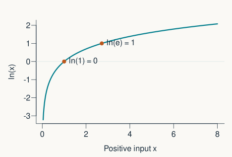{width=100% fig-alt="Natural logarithm of positive x, crossing zero at x equals 1 and reaching 1 at x equals e."}
:::
::: {.column width="42%"}
$$\ln(e^x)=x$$

$$\ln(ab)=\ln(a)+\ln(b)$$

For real logarithms: **positive inputs**.

::: {.small}
In R: `exp(x)` and `log(x)`.
:::
:::
::::

::: {.fragment}

:::: {.small}

The sum of two logarithm equal the logarithm of their product. This is useful when calculating the _joint probability_ of many independent events (it is computed as the product of individual event probabilities, and it is often convenient to turn this into a sum using logarithms).

::::

:::

::: {.notes}
In the product rule a and b must be positive. Natural log uses base e; papers may instead use log10 or log2, so check the methods and axes. Logarithmic scales turn multiplicative changes into additive distances. The plotted domain deliberately excludes zero, where ln is undefined as a real number (and log(0) returns -Inf in R).
:::

## Quiz: read the curve

::: {.prompt}
For $V(t)=V_0e^{-t/\tau}$, doubling $\tau$ makes the decay…

**A.** faster  **B.** slower  **C.** unchanged
:::

::: {.fragment}
**B. Slower.** It takes twice as long to reach the same fraction of $V_0$.
:::

::: {.notes}
At t = tau the remaining fraction is always exp(-1). A useful extra check: what happens to ln(x) when a positive x is multiplied by e? It increases by 1. 
:::

## The _gradient_ is a difference divided by a difference

:::: {.columns}
::: {.column width="58%"}
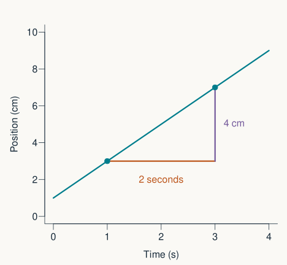{width=100% fig-alt="A line with rise 4 centimetres over a run of 2 seconds, giving a slope of 2 centimetres per second."}
:::
::: {.column width="42%"}
$$\frac{\Delta y}{\Delta t}
=\frac{4\ \mathrm{cm}}{2\ \mathrm{s}}
=2\ \mathrm{cm/s}$$

$\Delta$ means **change in**.
:::
::::

::: {.notes}
Link back to a familiar graph of position against time. The numerator is a vertical change, the denominator a horizontal change. This is not y/t: the starting values matter. Slope has units, which often tell us its scientific interpretation. For a line the slope is the same everywhere.
:::

## On a curve, the gradient depends on where you are

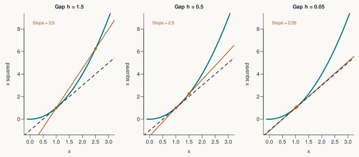{height=400 fig-alt="Three secant lines on x squared, using successively smaller gaps from x equals 1. Their gradients approach the dashed tangent slope of 2."}

::: {.fragment}

$$f'(x)=\frac{df}{dx}
=\lim_{h\to0}\frac{f(x+h)-f(x)}{h}$$

:::

::: {.notes}
Teal is the curve; orange is the secant through two points; the dashed line is the tangent. Read the formula as “change in output divided by a very small change in input”. Here x is 1 and the slopes are 3.5, 2.5 and 2.05, approaching 2. The derivative exists when this limiting slope exists. not all functions are differentiable: a sharp corner is a useful counterexample. The algebraic derivation is in the optional slides.
:::

## A derivative tells us the local direction of change

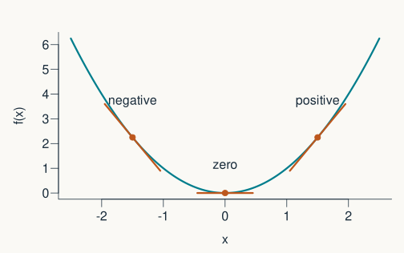{height=390 fig-alt="On x squared, a tangent slopes down to the left of zero, is horizontal at zero, and slopes up to the right."}

$$f(x)=x^2 \qquad\Rightarrow\qquad f'(x)=2x$$

::: {.notes}
Allow 2 minutes. A negative derivative means decreasing as x increases, not necessarily a negative function value. A zero derivative means a horizontal tangent, not automatically a maximum or minimum: x cubed at zero is a counterexample. Ask learners to point to a region where the value is positive but the derivative is negative.
:::


## Example: differentiating gaze position to compute gaze velocity

.center[]


## From gaze position to gaze velocity

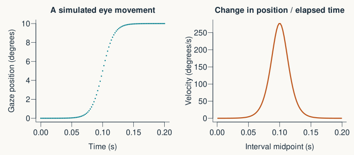{height=390 fig-alt="A simulated gaze position rises smoothly by 10 degrees. Its finite-difference velocity is a brief positive peak."}

_Numerical_ differentiation: for digital signals described by a set of points we can estimate the derivative using a finite difference approach

$$v_{i+1/2}\approx\frac{x_{i+1}-x_i}{t_{i+1}-t_i}$$

::: {.notes}
Label this as simulated. The subscript i refers to a sample number. The forward difference is naturally plotted at the midpoint of each interval; N positions give N-1 differences. Units are degrees divided by seconds. On a regular grid the denominator is the sampling interval. In R: velocity <- diff(position) / diff(time). Derivatives of data are estimates, unlike the exact derivative of an analytic function.
:::

## Small measurement errors can become large derivative errors

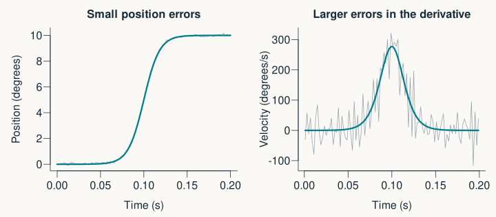{height=410 fig-alt="Small added noise barely changes the position trace but strongly changes the numerical velocity trace. The noiseless reference is teal."}


::: {.notes}
Explain qualitatively: subtracting nearby samples then dividing by a short interval amplifies rapid fluctuations. Smoothing can help, but changes timing and amplitude; it is an analysis choice that should be reported. Do not prescribe a particular filter or present a noisy derivative as a ground-truth velocity.
:::

<!-- ## Pause: keep track of the units -->

<!-- ::: {.prompt} -->
<!-- Gaze moves by $0.6^\circ$ between samples separated by **2 ms**. -->

<!-- What is its average velocity over this interval, in degrees per second? -->
<!-- ::: -->

<!-- ::: {.fragment} -->
<!-- $$\frac{0.6^\circ}{0.002\ \mathrm{s}}=300^\circ/\mathrm{s}$$ -->
<!-- ::: -->

<!-- ::: {.notes} -->
<!-- Allow 1 minute. The common wrong answer is 0.3: that is degrees per millisecond, not degrees per second. The point is unit conversion, not mental arithmetic speed. We have estimated average velocity over one interval, rather than knowing every instantaneous velocity within it. -->
<!-- ::: -->

## Probability _density_ functions

Normal or Gaussian distribution:

$$p(x) = \frac{1}{\sigma \sqrt{2 \pi}} e^{-\frac{1}{2} \left( \frac{x - \mu}{\sigma} \right)^2}$$

```{r, fig.height=4.5,fig.width=5.8, dev='svg', echo=F, message=F, fig.align='center'}
x <- seq(-6,6,1/10)
# paper <- "#faf9f5"
par(bg = "#faf9f5")
plot(x,dnorm(x), xlab="x",ylab="probability 'density'",type="l",col="blue",lwd=3, bty="n")
abline(h=0, lty=2)
abline(v=0, lty=2)

text(3, 0.3, expression(mu == 0), cex = 1.1, col="blue")
text(3, 0.27, expression(sigma == 1), cex = 1.1, col="blue")
```


## Probability _mass_ functions

Binomial distribution:

$$\Pr(x) = {n\choose k} p^k(1-p)^{n-k}$$

```{r, fig.height=4.5,fig.width=5.8, dev='svg', echo=F, message=F, fig.align='center'}

par(bg = "#faf9f5", mfrow=c(1,1))

simplepmf_binom <- function(size, prob,
                            xlab = "k", ylab = "probability 'mass'",
                            off = 0.20, lwd = 3,
                            col = c("black", "#8080FF"),
                            pch_top = 16, top_cex = 1,
                            ...) {
  stopifnot(length(size) == 1, size >= 0)

  k <- 0:size
  prob <- as.vector(prob)
  m <- length(prob)

  # compute pmf(s)
  Y <- sapply(prob, function(p) dbinom(k, size, p))
  if (is.null(dim(Y))) Y <- cbind(Y)  # ensure matrix

  if (length(col) < m) col <- rep_len(col, m)

  # limits & empty canvas
  ylim <- c(0, max(Y))
  xlim <- range(k) + c(-1, 1) * off
  plot(NULL, xlim = xlim, ylim = ylim, xlab = xlab, ylab = ylab,
       bty = "n", xaxt = "n", ...)
  axis(1, at = k)                 # integer ticks
  abline(h = 0, lty = 2, col = "gray60")

  # draw sticks (and optional dots at the top)
  for (i in seq_len(m)) {
    xoff <- (i - 1) * off
    for (j in seq_along(k)) {
      lines(c(k[j], k[j]) + xoff, c(0, Y[j, i]), lwd = lwd, col = col[i])
      if (!is.null(pch_top)) {
        points(k[j] + xoff, Y[j, i], pch = pch_top, cex = top_cex, col = col[i])
      }
    }
  }

  invisible(Y)
}

simplepmf_binom(size = 10, prob = 1/6,
                main = " ",
                col = "blue")

text(6, 0.27, expression(n == 10), cex = 1.1, col="blue")
text(6, 0.2, expression(p == frac(1, 6)), cex = 1.1, col="blue")

```

_Note: this is a discrete function, and therefore not differentiable._


## Sine and cosine turn angles into oscillations

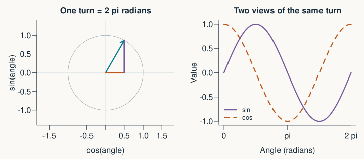{height=415 fig-alt="A unit circle shows cosine as the horizontal component and sine as the vertical component. Sine and cosine traces complete one cycle over two pi radians."}

$$360^\circ=2\pi\ \text{radians}$$

::: {.notes}
Allow 2 minutes. In a unit circle the radius is 1, so the horizontal and vertical components are cosine and sine. Both vary between -1 and 1. R sin and cos expect radians: sin(pi/2) = 1. No triangle identities need memorising. The traces differ by a quarter-cycle in phase. Trigonometric derivative rules also assume radians.
:::

## Four quantities set a simple rhythm

$$y(t)=b+A\cos(2\pi f t+\phi)$$

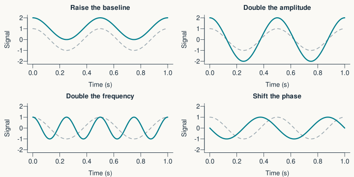{height=390 fig-alt="Four comparisons change only the baseline, amplitude, frequency or phase of a cosine wave; the unchanged reference is dashed."}

::: {.notes}
Allow 3 minutes. Read b as baseline, A as amplitude, f as frequency, and phi as phase in radians. The dashed reference is b=0, A=1, f=2 Hz and phi=0. Phase is not a frequency. A time shift t0 can instead be written A cos(2 pi f (t-t0)); then phi=-2 pi f t0. This avoids using the same symbol for an angle and a time. Amplitude is half the peak-to-peak range.
:::

## Period and frequency are reciprocals

$$f=\frac{1}{T}$$

| One cycle takes… | Frequency | Units |
|:---|:---|:---|
| $0.1$ seconds | $10$ | Hz = cycles/second |
| $1$ day | $1$ | cycle/day |
| $28$ days | $1/28\approx0.036$ | cycles/day |

::: {.prompt}
If the period halves, what happens to the frequency?
:::

::: {.notes}
Allow 2 minutes, including 20 seconds to predict: frequency doubles. EEG rhythms often use Hz; the later temperature example uses cycles/day. These units cannot be interchanged. A frequency of 1/24 cycles/day means a period of 24 days, not 24 hours. This distinction matters for interpreting the filter cutoff later.
:::

## A recording is a sequence of samples

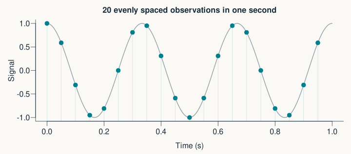{height=385 fig-alt="A continuous 3 Hz cosine with 20 regularly spaced sample points over one second."}

$$f_s=\frac{1}{\Delta t} \qquad t_i=\frac{i}{f_s},\quad i=0,\ldots,N-1$$

::: {.notes}
Allow 2 minutes. f is a frequency within the signal; fs is the number of measurements per second. They are different quantities. N samples span a DFT record of duration N/fs, while the last timestamp is (N-1)/fs. The code uses this convention so the stated sampling rate and time grid agree. Distinguish continuous model, sampled data, and sample index.
:::

## Sampling too slowly can disguise a rhythm

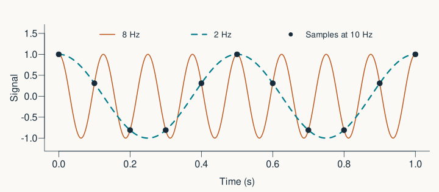{height=400 fig-alt="An 8 Hz cosine and a 2 Hz cosine pass through exactly the same points when sampled at 10 Hz."}

::: {.takeaway}
For a band-limited signal: $f_s>2f_{\max}$, with room for anti-alias filtering.
:::

::: {.notes}
Allow 3 minutes. Here two distinct continuous signals give identical samples: this is aliasing. The Nyquist frequency is fs/2 = 5 Hz. We cannot distinguish these signals from the shown samples without additional assumptions. The ideal sampling theorem assumes a band-limited signal and ideal reconstruction; in practice choose a higher rate and remove excessive high-frequency content before sampling. Filtering an already aliased record cannot generally recover what was lost. Avoid suggesting the Nyquist inequality alone guarantees good real-world measurements.
:::

## One signal can contain several rhythms

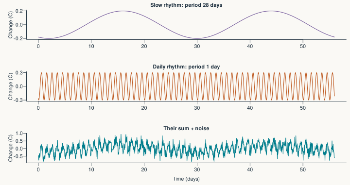{height=450 fig-alt="Simulated 28-day and daily temperature-like oscillations, followed by their sum with added random noise over 56 days."}

::: {.small}
Synthetic temperature-like signal · 56 days · hourly samples · baseline removed here
:::

::: {.notes}
Allow 2 minutes. Preserve the original example's daily and 28-day components, but explicitly call it a toy signal, not a model of menstrual physiology or an observed recording. The slow amplitude is 0.2 degrees C, daily amplitude 0.3, baseline 36.8, and noise SD 0.2. Ask students to predict which two frequencies should appear before showing the spectrum.
:::

## Adding sinusoids can build more complex shapes

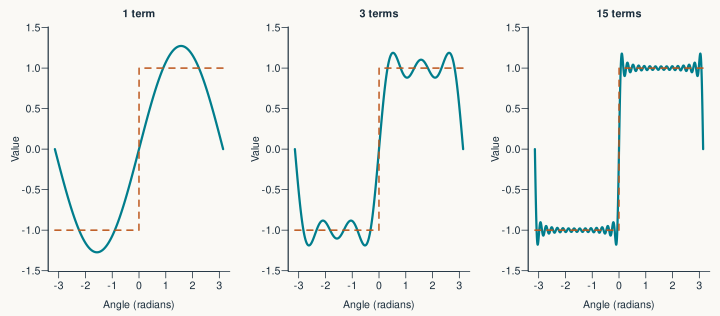{height=400 fig-alt="Approximations to a square wave using 1, 3 and 15 odd-harmonic sine terms. More terms sharpen the edges but leave local overshoot near jumps."}

::: {.takeaway}
A Fourier **series** describes a periodic waveform using harmonics.
:::

::: {.notes}
Allow 2 minutes. Harmonics are integer multiples of a fundamental frequency. We use sine terms here; sine and cosine together, or cosines with phase shifts, can describe much more general periodic waveforms. More terms improve the approximation overall under appropriate conditions, but do not uniformly remove the overshoot at discontinuities (Gibbs phenomenon). Avoid “every function is exactly a finite sum” or “more terms improves every point”. The sum is shown in the figure generator for interested students.
:::

## The Fourier transform changes the description

$$\underbrace{x_0,\ldots,x_{N-1}}_{\text{values over time}}
\quad\xrightarrow{\text{DFT}}\quad
\underbrace{Y_0,\ldots,Y_{N-1}}_{\text{frequency coefficients}}$$

| Term in a paper | Meaning |
|:---|:---|
| **DFT** | Discrete Fourier transform of sampled data |
| **FFT** | A fast algorithm for calculating the DFT |
| **Amplitude spectrum** | Magnitudes plotted against frequency |

::: {.notes}
Allow 2 minutes. Fourier series concerns a periodic function; the continuous Fourier transform is a related operation for continuous signals, and the DFT operates on a finite sequence. No complex-number derivation is needed: coefficients encode amplitude and phase together. Keeping every coefficient allows reconstruction of the original samples. Plotting only magnitudes discards phase information. The DFT treats the finite record as one period of a repeated sequence, which later explains edge effects.
:::

## Read the spectrum as a new set of axes

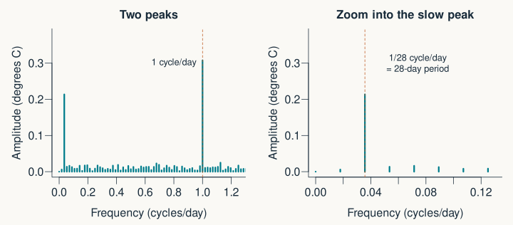{height=405 fig-alt="The amplitude spectrum has peaks at 1 cycle per day and 1/28 cycles per day. The second panel magnifies the low-frequency peak."}

::: {.takeaway}
Horizontal: **frequency**. Vertical: **amplitude**, in the signal's units.
:::

::: {.notes}
Allow 2 minutes. A peak's position describes its rate; a peak's height describes its amplitude under this normalisation. The daily component should have amplitude about 0.3 degrees C and the 28-day component about 0.2. Noise makes estimates imperfect. The mean was removed, so DC is approximately zero. An amplitude spectrum, squared amplitude and power spectral density are different quantities; check axis labels and units rather than calling every spectrum “power”.
:::

## R: make the signal, then transform it

```{r}
#| echo: true
#| eval: false
samples_per_day <- 24
N <- 56 * samples_per_day
t <- (0:(N - 1)) / samples_per_day
slow <- 0.2 * cos(2 * pi * (t - 16) / 28)
daily <- 0.3 * cos(2 * pi * (t - 14 / 24))
set.seed(10)
x <- 36.8 + slow + daily + rnorm(N, sd = 0.2)
Y <- fft(x - mean(x))
```

::: {.small}
Complete, commented example: [R/fourier_transform.R](R/fourier_transform.R)
:::

::: {.notes}
Allow 2 minutes as a demonstration, or provide the script after class. There are 1344 samples. The time vector excludes the right endpoint, giving exactly 24 samples/day. The same equations and seed produce the plotted example. A random-number generator makes the noise, but probability theory is outside today's scope. Explain that removing the mean isolates changes relative to baseline. Students need not memorise the code.
:::

## R: put the frequency labels and amplitudes on the FFT

```{r}
#| echo: true
#| eval: false
k <- 0:floor(N / 2)
frequency <- k * samples_per_day / N
amplitude <- Mod(Y[k + 1]) / N
paired <- k > 0 & k < N / 2
amplitude[paired] <- 2 * amplitude[paired]
plot(frequency, amplitude, type = "h", xlim = c(0, 1.3))
```

::: {.takeaway}
Bin spacing: $\Delta f=f_s/N=1/56$ cycles/day.
:::

::: {.notes}
Allow 2 minutes. R indexes from 1, so zero-frequency bin k=0 is Y[1]. Mod gives the magnitude of a complex coefficient. For a real signal, positive and negative frequencies pair up. Double interior positive-frequency amplitudes, but not DC or the Nyquist bin (the latter exists for even N). The supplied script handles odd N too. Longer recording duration gives finer bin spacing; increasing sampling rate alone does not, if duration stays fixed. Zero-padding only makes a denser frequency grid, not extra resolving information.
:::

## Filtering selects which components to retain

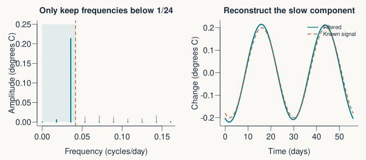{height=405 fig-alt="A low-pass mask retains frequencies below 1/24 cycles per day. Inverse transformation approximately recovers the known slow component."}

$$|f|<1/24\ \text{cycles/day}\quad\Longleftrightarrow\quad T>24\ \text{days}\quad(f\ne0)$$

::: {.notes}
Allow 2 minutes. This follows the cutoff in the supplied MATLAB file, while correcting the original slide's “2 days” label. The strict inequality retains the 28-day rhythm and rejects the daily rhythm. DC is retained by the mask but is already approximately zero after centring. The slow estimate still contains low-frequency noise: filtering does not magically identify the underlying biology. A hard cutoff is a demonstration; it can cause ringing and edge effects.
:::

## R: reconstruct after filtering

```{r}
#| echo: true
#| eval: false
f_signed <- (0:(N - 1)) * samples_per_day / N
f_signed[f_signed > samples_per_day / 2] <-
  f_signed[f_signed > samples_per_day / 2] - samples_per_day
Y[abs(f_signed) >= 1 / 24] <- 0
slow_change <- Re(fft(Y, inverse = TRUE)) / N
temperature_filtered <- mean(x) + slow_change
```

::: {.takeaway}
Keep both frequency partners. Divide the inverse FFT by $N$.
:::

::: {.notes}
Allow 2 minutes. The signed frequency array matches R's unshifted FFT ordering. Applying the mask symmetrically keeps the reconstructed signal real up to floating-point roundoff. Re discards those tiny imaginary residuals. Unlike MATLAB ifft, R fft with inverse=TRUE does not divide by N; the code must do it. slow_change is baseline-free and temperature_filtered restores the mean. The standalone script preserves the original Y and makes a separate Y_filtered for clearer experimentation.
:::

## Translate a methods sentence

::: {.prompt}
“We sampled at 500 Hz, differentiated position, and examined the Fourier amplitude spectrum.”
:::

::: {.fragment}
**500 Hz** → one sample every 2 ms.

**Differentiated** → estimated how quickly position changed.

**Amplitude spectrum** → examined the strength of each frequency component.
:::

::: {.notes}
Allow 1 minute. This is an invented methods sentence, not a quotation from a paper. Ask learners to name one missing detail: units, derivative method, artefact handling, record duration, frequency units or normalisation. A spectrum alone does not prove a neural oscillator exists. Do not add inferential statistics here.
:::

## Three things you can now explain {#part1-recap}

| See this… | Ask this… |
|:---|:---|
| $y=f(x)$ | What are the inputs, parameters and units? |
| $dy/dt$ | Which change per unit time is being measured? |
| A spectrum | What do the axes and peaks mean? |

::: {.prompt}
Exit check: a peak at **5 Hz** corresponds to what period?
:::

::: {.notes}
Allow 1 minute. Answer: 1/5 second = 0.2 seconds = 200 ms. This is the end of the core lecture. Take a break before Part 2. Extensions follow for extra time, questions or independent study. The key bridge into linear algebra is that a sampled signal is also a vector, and a transform changes its representation.
:::

## Differentiating the function $f(x)=x^2$ {.optional}

<!-- $$\begin{aligned} -->
<!-- \frac{(x+h)^2-x^2}{h} -->
<!-- &=\frac{2xh+h^2}{h}\\[0.5em] -->
<!-- &=2x+h\quad(h\ne0)\\[0.5em] -->
<!-- \lim_{h\to0}(2x+h)&=2x -->
<!-- \end{aligned}$$ -->

$$\begin{align}
\frac{df}{dx} &= \lim_{h \rightarrow 0} \frac{f(x + h)-f(x)}{(x + h) - x}\\
&=\lim_{h\to 0 }\frac{(x+h)^2-x^2}{h} \\
&=\lim_{h\to 0}\frac{x^2+2xh+h^2-x^2}{h} \\
&=\lim_{h\to 0}\frac{2xh+h^2}{h} \\
&=\lim_{h\to 0}2x+h \\
&= 2x
\end{align}$$

::: {.notes}
Optional, about 3 minutes. Expand the square on paper if needed. We divide by nonzero h and then take the limit; substituting h=0 into the original fraction would give 0/0, not the derivative. This replaces many near-identical algebra slides in the original. Start from the geometric interpretation already established.
:::

## A small derivative reference {.optional}

| Function | Derivative |
|:---|:---|
| $x^n$ | $nx^{n-1}$ |
| $e^x$ | $e^x$ |
| $\ln x$, $x>0$ | $1/x$ |
| $\sin x$ | $\cos x$ |
| $\cos x$ | $-\sin x$ |

$$\frac{d}{dt}e^{-t/\tau}=-\frac{1}{\tau}e^{-t/\tau}$$

::: {.notes}
Optional, about 2 minutes. The power rule is used on domains where the real-valued function is defined and differentiable; start with positive integer n. Sine and cosine derivatives assume radians. The final example applies the chain rule: multiply by the derivative of the exponent. Present this as a lookup aid, not an additional memorisation objective.
:::

## Integration adds up change {.optional}

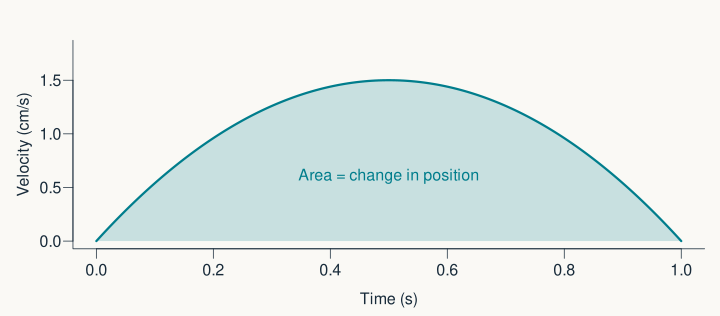{height=380 fig-alt="The shaded area under a non-negative velocity curve gives the net change in position."}

$$x(t_2)-x(t_1)=\int_{t_1}^{t_2}v(t)\,dt$$

::: {.notes}
Optional, about 2 minutes. Integration is accumulation, the complementary idea to differentiation. Units: (cm/s) times seconds gives cm. Area below the time axis counts negatively, so this is displacement, not always total distance travelled. For sampled data a sum of velocity times interval duration approximates this integral. This brief bridge helps with later papers without turning the lecture into a calculus course.
:::

## An amplitude spectrum does not show timing {.optional}

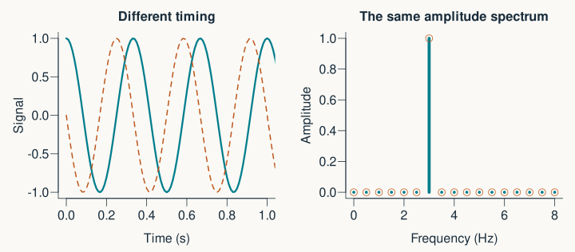{height=405 fig-alt="Two 3 Hz cosines with different phase have different time traces but identical amplitude spectra."}

::: {.takeaway}
Reconstruction needs **phase** as well as amplitude.
:::

::: {.notes}
Optional, about 2 minutes. The plotted circles and bars overlap in the spectrum. A time shift changes the Fourier phases while leaving magnitudes unchanged. A full Fourier transform retains both kinds of information; a magnitude-only plot does not. This is why a spectrum cannot answer every question about event timing.
:::

## Finite windows spread spectral energy {.optional}

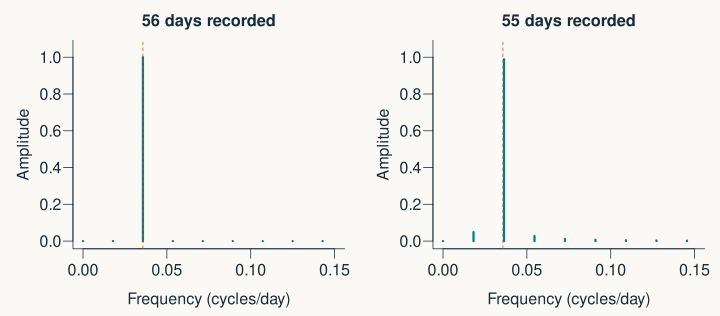{height=405 fig-alt="A 28-day cosine fits exactly into a 56-day record, giving a concentrated peak; a 55-day record spreads amplitude into neighbouring bins."}

::: {.takeaway}
Spectral leakage depends on the recording window.
:::

::: {.notes}
Optional, about 2 minutes. Both examples are noiseless, so the extra bins are not measurement noise. Repeating a finite record with unmatched endpoints creates a discontinuity. Windowing can reduce leakage but changes amplitude calibration and resolution. The original worked example intentionally uses complete cycles to keep the first demonstration clear. A single nearby bin need not contain the full sinusoidal amplitude when the frequency falls between bins.
:::

## Images also have frequencies {.optional}

{height=380 fig-alt="An R-generated image made from a smooth blob plus stripes, separated by a two-dimensional Fourier low-pass filter into broad structure and fine detail."}

Spatial frequency: **cycles per unit distance**, rather than per second.

::: {.notes}
Optional, about 2 minutes. This synthetic R-generated example replaces the unattributed photograph in the original. The smooth component contains low spatial frequencies and the stripes high spatial frequencies. All three images are independently contrast-scaled for visibility; brightness is not directly comparable across panels. The code uses a radial mask in two dimensions and divides the inverse FFT by the number of pixels. Do not imply that these are brain images.
:::
