```{r}
#| include: false
source("R/pca_example.R", local = TRUE)
```

## From many measurements to a simpler picture

| Tool | What it lets us do |
|:---|:---|
| **Vector** | Collect measurements into one object |
| **Matrix** | Organise data or combine measurements |
| **Projection** | Describe an observation along a chosen direction |
| **PCA** | Find directions that capture the most variation |

::: {.takeaway}
Keep asking: what do the **rows**, **columns** and **axes** represent?
:::

::: {.notes}
Allow 1 minute. Start with data rather than a list of unfamiliar vocabulary. A sampled signal from Part 1 is already a vector. Today's destination is understanding a PCA plot in a neuroscience paper, not calculating a large eigendecomposition by hand. We need only a geometric, descriptive introduction to covariance; probability theory remains outside this lecture. The core ends at “Read the mathematics in a paper”.
:::

## A data matrix has rows and columns

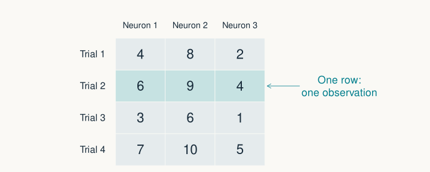{height=420 fig-alt="A four by three table of toy neural responses. Rows are trials and columns are neurons; one trial is highlighted."}

$$\mathbf X\in\mathbb R^{n\times p}
\qquad n\text{ observations},\ p\text{ variables}$$

::: {.notes}
Allow 2 minutes. The figure has 4 rows and 3 columns; ask students to locate trial 2, neuron 3. Here the answer is 4. These are invented responses in common arbitrary units. Other papers may use columns for observations: check, do not assume. Our PCA script consistently uses observations in rows, variables in columns. A matrix is a rectangular array; only some matrices are square.
:::

## A vector is a list and a point

:::: {.columns}
::: {.column width="58%"}
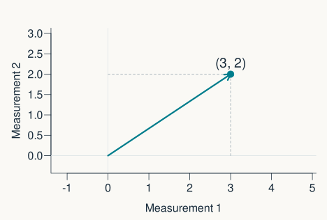{width=100% fig-alt="An arrow from the origin to coordinates 3,2, with dashed guides to the two measurement axes."}
:::
::: {.column width="42%"}
$$\mathbf x=\begin{bmatrix}3\\2\end{bmatrix}$$

Two measurements → one point in **two dimensions**.

::: {.small}
An arrow from the origin gives the same coordinates.
:::
:::
::::

::: {.notes}
Allow 2 minutes. This arrow begins at the origin. Its coordinates represent measurements, not necessarily physical spatial position. Three numbers would be a point in 3D; 100 neurons give a 100-dimensional vector, even though we cannot draw that space. In the data matrix each observation is a row; for geometric calculations we often display the same coordinates as a column vector. Transpose will connect these conventions later.
:::

## Add vectors; multiply them by a scalar

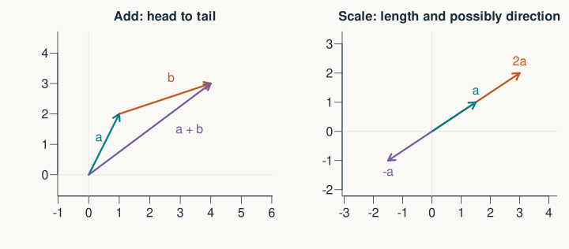{height=405 fig-alt="Head-to-tail addition of two arrows on the left; a vector, twice that vector, and its negative on the right."}

$$\begin{bmatrix}1\\2\end{bmatrix}+\begin{bmatrix}3\\1\end{bmatrix}
=\begin{bmatrix}4\\3\end{bmatrix}
\qquad
2\begin{bmatrix}1.5\\1\end{bmatrix}=\begin{bmatrix}3\\2\end{bmatrix}$$

::: {.notes}
Allow 2 minutes. Add corresponding coordinates; geometrically put one arrow's tail at the other's head. “Scalar” simply means one number. A positive scalar changes length; a negative scalar also reverses the arrow; zero gives the zero vector. Vector addition is commutative. Point out that the right-hand example uses a different starting vector to keep its diagram uncluttered.
:::

## A linear combination is a weighted sum

$$c\mathbf v+d\mathbf w
=c\begin{bmatrix}1\\1\end{bmatrix}
+d\begin{bmatrix}2\\3\end{bmatrix}
=\begin{bmatrix}c+2d\\c+3d\end{bmatrix}$$

::: {.prompt}
Set $c=2$ and $d=-1$. Where do you land?
:::

::: {.fragment}
$$2\mathbf v-\mathbf w=\begin{bmatrix}0\\-1\end{bmatrix}$$
:::

::: {.notes}
Allow 2 minutes. Let students calculate one coordinate at a time. The coefficients may be negative or zero and need not sum to 1. A weighted average is a special case, not the definition. Relate weighted sums to regression predictors and weighted neural inputs, which reappear in optional examples.
:::

## Span: everywhere those combinations can reach

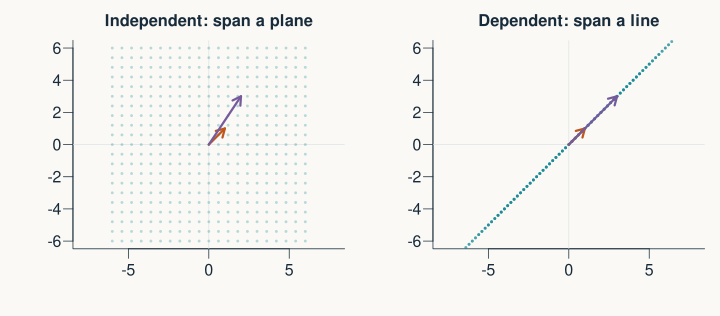{height=395 fig-alt="Combinations of two independent vectors spread over a plane. Combinations of two collinear vectors stay on a line."}

::: {.takeaway}
A **basis** is an independent set that spans the space being described.
:::

::: {.notes}
Allow 3 minutes. Left: v=(1,1), w=(2,3), so these two vectors span the whole plane. Right: w=(3,3)=3v, so the span is only a line. Dots show a finite sample of combinations; the mathematical span permits every real coefficient. “Independent” means no vector in the set can be made from the others. Two independent vectors are a basis for this plane. Independence here is algebraic, not statistical independence. A redundant column need not be identical: it can be any linear combination of the others.
:::

## A matrix packages the columns we want to combine

$$\mathbf A=
\begin{bmatrix}1&2\\1&3\end{bmatrix}
=\begin{bmatrix}\mathbf v&\mathbf w\end{bmatrix}$$

$$\underbrace{\mathbf A}_{2\times2}
\underbrace{\begin{bmatrix}c\\d\end{bmatrix}}_{2\times1}
=c\mathbf v+d\mathbf w$$

::: {.takeaway}
Matrix × vector = a weighted sum of the matrix's **columns**.
:::

::: {.notes}
Allow 2 minutes. Use the exact vectors from the preceding example. Each element of the coefficient vector tells us how much of one column to use. With c=2 and d=-1 the result is again (0,-1). Say dimensions aloud: two by two times two by one gives two by one. This provides a second way to understand matrix-vector multiplication before introducing rows and dot products.
:::

## A dot product multiplies, then adds

$$\mathbf a^\mathsf T\mathbf b
=a_1b_1+a_2b_2+\cdots+a_pb_p$$

$$\begin{bmatrix}1&2\end{bmatrix}
\begin{bmatrix}3\\1\end{bmatrix}
=1\times3+2\times1=5$$

::: {.takeaway}
The result is **one number**.
:::

::: {.notes}
Allow 2 minutes. Both vectors must have the same number of coordinates. The superscript T means transpose: it makes our column vector a row. In R, sum(a * b) is a dot product for equal-length numeric vectors; beware that R recycles a shorter vector in elementwise operations. We introduce the geometric meaning next. A dot product is not itself an angle.
:::

## Dot products also describe alignment

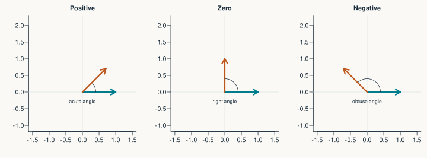{height=340 fig-alt="Pairs of vectors at acute, right and obtuse angles have positive, zero and negative dot products respectively."}

$$\mathbf a^\mathsf T\mathbf b
=\|\mathbf a\|\,\|\mathbf b\|\cos\theta$$

::: {.small}
In 2D: $\|\mathbf a\|=\sqrt{a_1^2+a_2^2}$. The angle requires **nonzero** vectors.
:::

::: {.notes}
Allow 2 minutes. Norm is sqrt(sum(a^2)). Both length and angle affect the dot product, so it is not an angular distance. To obtain cosine similarity, divide by both lengths; to obtain an angle, apply inverse cosine. Zero dot product means orthogonal; a zero vector is also orthogonal in the algebraic sense, but has no defined direction or angle. Geometric orthogonality does not in general imply statistical independence.
:::

## Projection gives a coordinate along an axis

:::: {.columns}
::: {.column width="58%"}
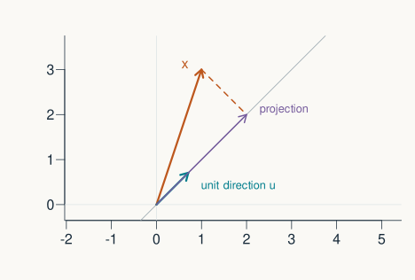{width=100% fig-alt="A point is projected perpendicularly onto a diagonal line. The unit direction along the line is marked separately."}
:::
::: {.column width="42%"}
For a **unit** direction $\mathbf u$:

$$z=\mathbf x^\mathsf T\mathbf u$$

$$\text{projected vector}=z\mathbf u$$

::: {.small}
One number locates the point along this line.
:::
:::
::::

::: {.notes}
Allow 3 minutes. Unit means length 1. In this drawing x=(1,3) and u=(1,1)/sqrt(2); the scalar coordinate is 2sqrt(2), and the projected vector is (2,2). The dashed segment is perpendicular to the chosen axis. Distinguish scalar score z from the two-coordinate projected point zu. This distinction is central to PCA and helps explain what reducing dimensionality means.
:::

## Transpose swaps rows and columns

$$\mathbf A=
\begin{bmatrix}1&2&3\\4&5&6\end{bmatrix}
\qquad\Longrightarrow\qquad
\mathbf A^\mathsf T=
\begin{bmatrix}1&4\\2&5\\3&6\end{bmatrix}$$

$$2\times3\quad\longrightarrow\quad3\times2$$

::: {.small}
In R: `t(A)`.
:::

::: {.notes}
Allow 1 minute. Follow one entry through the operation: row 1, column 3 becomes row 3, column 1. Transpose is not an inverse and does not change the values themselves. We will transpose the centred data matrix when computing covariance. A plain numeric R vector has no two-dimensional dim attribute; use matrix or drop=FALSE when preserving matrix dimensions matters.
:::

## Matrix multiplication: a row meets a column

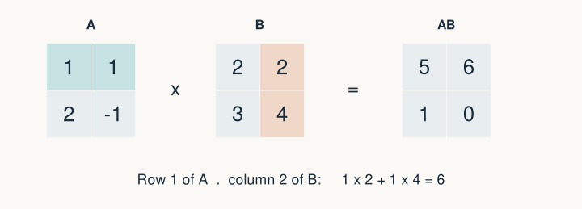{height=400 fig-alt="Matrices A and B multiply to entries 5,6 in the first row and 1,0 in the second. The highlighted first row and second column give entry 6."}

::: {.notes}
Allow 2 minutes. This recreates the original hand-drawn example with editable R graphics. A has rows (1,1) and (2,-1); B has columns (2,3) and (2,4). Highlighted entry: 1*2 + 1*4 = 6. Ask students to check the lower-left result: 2*2 + (-1)*3 = 1. Every output entry is a dot product, so this generalises to rectangular matrices.
:::

## The same product, one column at a time

$$\mathbf A\mathbf B
=\begin{bmatrix}\mathbf A\mathbf b_1&\mathbf A\mathbf b_2\end{bmatrix}$$

$$\mathbf A\begin{bmatrix}2\\3\end{bmatrix}
=2\begin{bmatrix}1\\2\end{bmatrix}
+3\begin{bmatrix}1\\-1\end{bmatrix}
=\begin{bmatrix}5\\1\end{bmatrix}$$

::: {.takeaway}
Each column of the product is a combination of columns of $\mathbf A$.
:::

::: {.notes}
Allow 1 minute. This is the same calculation as the previous slide, not a different multiplication rule. The first column of B supplies the weights 2 and 3. The second supplies 2 and 4. This replaces the original second handwritten multiplication page. If time is tight, say the equivalence briefly and move on; learners do not need fluency with both algorithms immediately.
:::

## Check the dimensions before multiplying

$$\underbrace{\mathbf A}_{m\times n}
\underbrace{\mathbf B}_{n\times p}
=\underbrace{\mathbf C}_{m\times p}$$

::: {.prompt}
$(100\times3)(3\times2)$ → what shape?

Can we reverse the order?
:::

::: {.fragment}
**$100\times2$**. Reversed: inner dimensions $2$ and $100$ do not match.
:::

::: {.notes}
Allow 2 minutes. The inner dimensions must agree; the outer dimensions give the output. Even when both AB and BA are defined, they need not be equal. When the products are defined, multiplication is associative: (AB)C=A(BC). In data terms, 100 observations of 3 variables can be combined into 2 new variables by a 3-by-2 weight matrix.
:::

## In R, `*` and `%*%` do different jobs

:::: {.columns}
::: {.column width="50%"}
**Element by element**

```{r}
#| echo: true
A <- matrix(c(1, 1, 2, -1), 2, byrow = TRUE)
B <- matrix(c(2, 2, 3, 4), 2, byrow = TRUE)
A * B
```
:::
::: {.column width="50%"}
**Matrix multiplication**

```{r}
#| echo: true
A %*% B
```

Rows meet columns; products are added.
:::
::::

::: {.notes}
Allow 2 minutes. This is the key syntax change from MATLAB: MATLAB * corresponds to R %*%, and MATLAB .* corresponds to R *. For A*B the lower-right value is -4; for A%*%B it is zero. byrow=TRUE makes the literal input match our written rows; otherwise R fills a matrix column first. Elementwise multiplication is also called the Hadamard product and needs compatible shapes. Do not add several R shortcuts at once.
:::

## A matrix can transform a whole space

$$\mathbf S=\begin{bmatrix}2&0\\0&1\end{bmatrix}
\qquad\mathbf S\begin{bmatrix}x_1\\x_2\end{bmatrix}
=\begin{bmatrix}2x_1\\x_2\end{bmatrix}$$

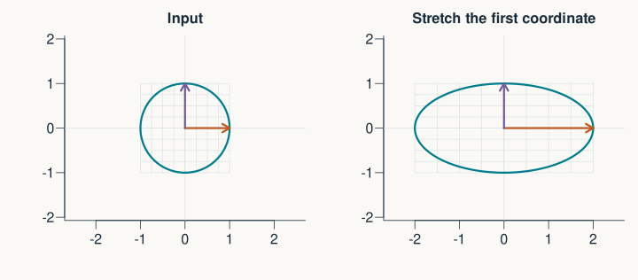{height=375 fig-alt="A circle and square grid become an ellipse and horizontally stretched grid under a matrix that doubles the first coordinate."}

::: {.notes}
Allow 2 minutes. The transformation doubles the first coordinate and leaves the second unchanged. Equal axis scales are essential: otherwise an undistorted circle might look stretched. Linear transformations preserve addition and scalar multiplication and map the origin to the origin. Translations need an added offset and are affine, not purely linear. Matrix columns tell us where the original coordinate basis vectors go.
:::

## Eigenvectors keep the same line of action

$$\mathbf S\mathbf v=\lambda\mathbf v,\qquad\mathbf v\ne\mathbf0$$

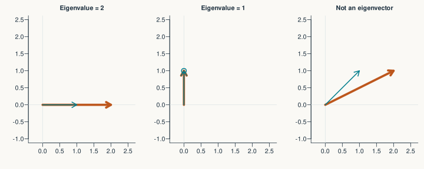{height=365 fig-alt="Under horizontal stretching, the horizontal vector doubles and the vertical vector is unchanged. A diagonal vector changes direction and is not an eigenvector."}

::: {.small}
Teal: input. Orange: transformed vector. $\lambda$ is the eigenvalue.
:::

::: {.notes}
Allow 3 minutes. For S=diag(2,1), the coordinate axes are eigenvector directions with eigenvalues 2 and 1. The diagonal vector (1,1) maps to (2,1), not a scalar multiple of itself. For general real eigenvalues, negative values reverse direction and zero maps the eigenvector to zero; “same direction” without qualification is incomplete. The zero vector is excluded by definition. Real matrices do not always have real eigenvectors, but real symmetric covariance matrices do; the deeper caveat is in the extensions.
:::

## PCA asks: which direction keeps the most variation?

:::: {.columns}
::: {.column width="58%"}
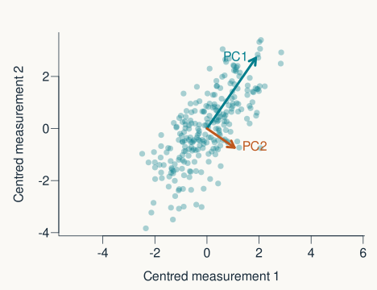{width=100% fig-alt="A cloud of correlated measurements with PC1 along its long axis and PC2 perpendicular to it. Arrows are two score standard deviations long."}
:::
::: {.column width="42%"}
**PC1:** largest variance of projected scores.

**PC2:** largest remaining variance, perpendicular to PC1.

::: {.small}
Synthetic data · two related measurements
:::
:::
::::

::: {.notes}
Allow 2 minutes. PCA is principal component analysis. We compare unit directions, otherwise making an arrow longer would trivially increase projected variance. In 2D, once PC1 is chosen the perpendicular axis is PC2. In higher dimensions we continue choosing orthogonal directions. No outcome labels are used. Arrows in this figure have length 2 sqrt(lambda), i.e. two score standard deviations; they are not unit loadings drawn to scale or confidence intervals.
:::

## Step 1: centre each variable

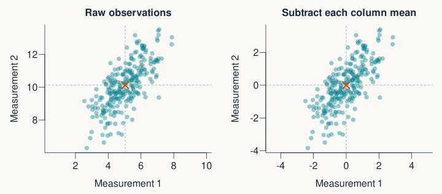{height=410 fig-alt="The same point cloud before and after subtracting each variable's mean. The mean moves to the origin; the shape does not change."}

$$X_{c,ij}=X_{ij}-\overline X_j$$

::: {.notes}
Allow 2 minutes. A subscript ij means observation i, variable j. Each column gets its own mean subtracted; we are not subtracting a row mean or one grand mean. Centring moves the cloud to the origin without changing its shape. The MATLAB example generated zero-mean populations but did not centre the finite sample, whose mean is not exactly zero. The new example deliberately adds offsets so learners can see why this step matters. Centring is different from scaling.
:::

## Step 2: summarise how centred variables vary together

:::: {.columns}
::: {.column width="53%"}
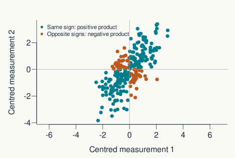{width=100% fig-alt="Most centred points have the same sign on both axes, giving positive cross-products and positive covariance."}
:::
::: {.column width="47%"}
$$\mathbf S=\frac{\mathbf X_c^\mathsf T\mathbf X_c}{n-1}$$

$$\begin{bmatrix}
\operatorname{Var}(x_1)&\operatorname{Cov}(x_1,x_2)\\
\operatorname{Cov}(x_1,x_2)&\operatorname{Var}(x_2)
\end{bmatrix}$$

::: {.small}
Diagonal: spread.<br>Off diagonal: variation together.
:::
:::
::::

::: {.notes}
Allow 3 minutes. This is the minimum descriptive covariance bridge required for PCA, not a probability lesson. Same-sign centred values have positive products; opposite signs have negative products. Sum those products and divide by n-1 for sample covariance. For a diagonal entry we multiply a variable by itself, giving its variance. Covariance is symmetric, and here S is p by p = 2 by 2. The denominator changes eigenvalue scale relative to 1/n but not directions or variance fractions. cov(X) handles the centring internally.
:::

## Step 3: directions and amounts of variation

$$\mathbf S\mathbf v_j=\lambda_j\mathbf v_j$$

| PCA object | What it represents |
|:---|:---|
| Eigenvector $\mathbf v_j$ | A unit direction: the **loading vector** |
| Eigenvalue $\lambda_j$ | Variance of scores along that direction |
| Largest eigenvalue | The first principal component direction |

::: {.takeaway}
Directions are weights. They are not the observations' coordinates.
:::

::: {.notes}
Allow 2 minutes. For a real symmetric covariance matrix, eigenvectors can be chosen orthonormal and eigenvalues are nonnegative up to numerical precision. Tied eigenvalues mean a unique direction is not determined within the tied subspace. Some papers use “loadings” for eigenvectors scaled by sqrt(lambda); here loadings means unit eigenvectors, as in R prcomp rotation. Explain this terminology distinction so readers check each paper's methods.
:::

## R: build the example and find the directions

```{r}
#| echo: true
#| eval: false
set.seed(2)
n <- 250
x1 <- rnorm(n)
x2 <- x1 + rnorm(n)
X <- cbind(x1 + 5, x2 + 10)
Xc <- X
for (j in 1:ncol(X)) Xc[, j] <- X[, j] - mean(X[, j])
S <- t(Xc) %*% Xc / (n - 1)
decomposition <- eigen(S, symmetric = TRUE)
V <- decomposition$vectors
```

::: {.small}
Complete, commented example: [R/pca_example.R](R/pca_example.R)
:::

::: {.notes}
Allow 3 minutes as an instructor demonstration. This follows the same data-generating relation as the original MATLAB example, x2=x1+noise, with added offsets. Only functions included with R are used. Read each line as one of the three preceding steps. eigen with symmetric=TRUE returns unit vectors as columns and eigenvalues in decreasing order. It is the one numerical solver in an otherwise explicit calculation. We do not ask students to code an eigensolver. The script chooses stable signs for figures; PCA signs do not have intrinsic meaning.
:::

## Step 4: scores are the new coordinates

$$\underbrace{\mathbf Z}_{n\times p}
=\underbrace{\mathbf X_c}_{n\times p}
\underbrace{\mathbf V}_{p\times p}$$

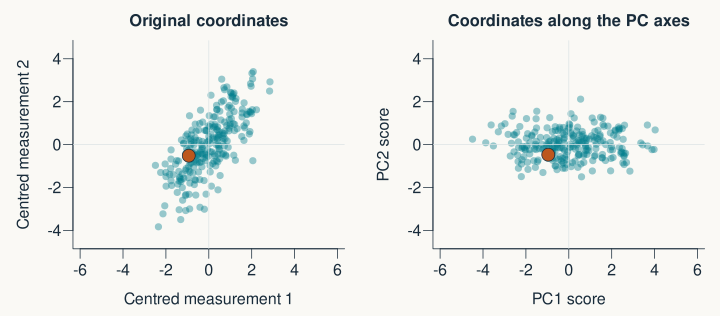{height=365 fig-alt="The same observations in original and principal component coordinates. A highlighted observation appears in both; the point cloud is now aligned with the axes."}

::: {.notes}
Allow 2 minutes. Each score is a dot product of an observation and a loading vector. The orange dot tracks the same observation across the panels. Keeping all PCs changes coordinates without discarding information; reducing dimensionality happens when we retain fewer PCs. PCA scores have zero mean after centring, and distinct score columns have zero sample covariance. Zero covariance is not general statistical independence.
:::

## How much variation does each component retain?

:::: {.columns}
::: {.column width="56%"}
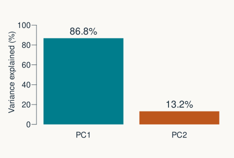{width=100% fig-alt="Bars show the percentage of total sample variance along PC1 and PC2. PC1 contains most of the variance in this simulated example."}
:::
::: {.column width="44%"}
$$\text{fraction for PC }j=\frac{\lambda_j}{\sum_k\lambda_k}$$

PC1 retains **`r round(100 * variance_fraction[1], 1)`%** here.

::: {.small}
High variance does not establish biological importance.
:::
:::
::::

::: {.notes}
Allow 2 minutes. The percentage is computed from the actual simulated sample, not hard-coded. Variance has squared measurement units; dividing by the total makes a dimensionless fraction. Low variance might contain useful biological information and high variance might be an artefact. The number of components should follow the scientific goal rather than an unexplained universal percentage threshold.
:::

## Step 5: keep one score and reconstruct an approximation

:::: {.columns}
::: {.column width="58%"}
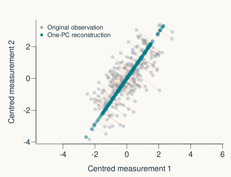{width=100% fig-alt="Original observations are projected onto PC1; faint connecting lines show the discarded perpendicular variation."}
:::
::: {.column width="42%"}
$$\widehat{\mathbf x}_c=z_1\mathbf v_1$$

One coordinate gives a point on a line.

Add the means back to recover the original units and location.
:::
::::

::: {.notes}
Allow 2 minutes. The reconstruction is the perpendicular projection already introduced. Keeping the leading k PCs minimises total squared reconstruction error among k-dimensional linear subspaces of the centred data. This does not necessarily minimise an error relevant to the scientific question. The figure remains centred to show the geometry; the script also restores each column mean. Retaining all components reconstructs X up to floating-point error.
:::

## R: project, measure retained variance, reconstruct

```{r}
#| echo: true
#| eval: false
scores <- Xc %*% V
lambda <- decomposition$values
variance_fraction <- lambda / sum(lambda)
z1 <- scores[, 1, drop = FALSE]
v1 <- V[, 1, drop = FALSE]
Xc_approx <- z1 %*% t(v1)
X_approx <- Xc_approx
for (j in 1:ncol(X)) {
  X_approx[, j] <- Xc_approx[, j] + mean(X[, j])
}
```

::: {.notes}
Allow 2 minutes. z1 is 250 by 1, v1 is 2 by 1, and the reconstruction is 250 by 2. drop=FALSE preserves matrix dimensions when taking a single column; it is helpful housekeeping, not a new mathematical operation. Point to how this code implements the preceding equations directly. The fully commented script contains exercises about changing offsets, scales, signs and correlation. prcomp is used only as an independent validation reference outside the teaching example.
:::

## Pause: which changes should affect PCA?

::: {.prompt}
**A.** Add 100 to every value in one column.

**B.** Multiply one column by 100.

**C.** Reverse a loading vector and its corresponding scores.
:::

::: {.fragment .small}
**A:** centring removes it. **B:** generally changes covariance PCA.<br>
**C:** same axis and reconstruction; opposite signs.
:::

::: {.notes}
Allow 2 minutes. Give time to discuss before revealing. Adding an offset does not change centred data. Changing a variable's scale changes its influence, which is why units and standardisation must be reported. A sign flip is arbitrary, not a biological reversal: (-z)(-v)=zv. For new data, retain the means, scales and loadings estimated from the training data rather than refitting them. That last point is optional, not a required machine-learning topic.
:::

## In a paper: a trajectory through population activity

:::: {.columns}
::: {.column width="61%"}
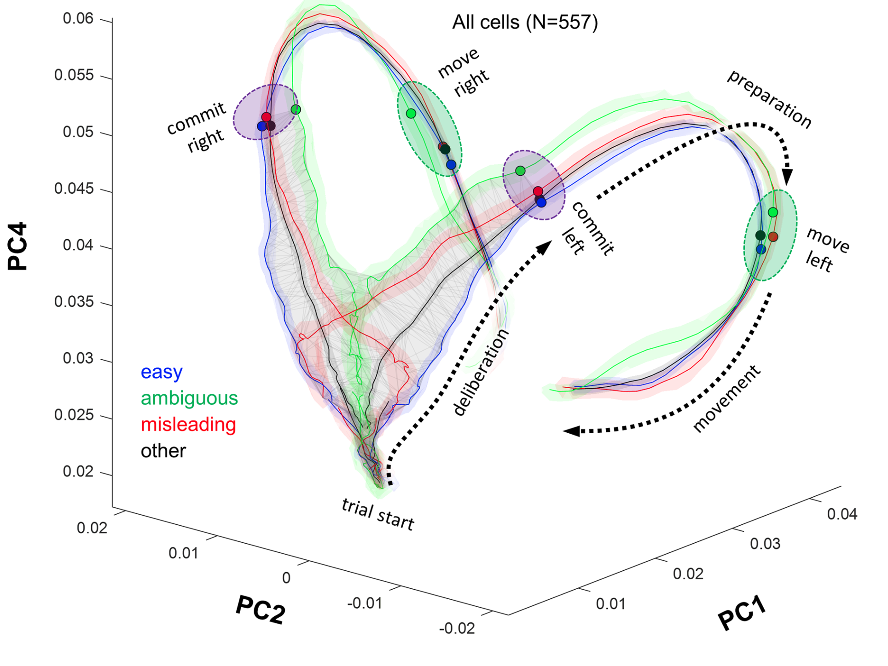{height=455 fig-alt="Panel A of Figure 4 from Thura and colleagues shows neural population trajectories for different trial types on axes PC1, PC2 and PC4."}
:::
::: {.column width="39%"}
**Figure 4A**

Each location = population activity at a time point.

PC axes = weighted combinations of neural responses.

The line links successive states.
:::
::::

::: {.credit}
Thura, Cabana, Feghaly & Cisek (2022), *PLOS Biology*, Figure 4A. [doi:10.1371/journal.pbio.3001861](https://doi.org/10.1371/journal.pbio.3001861). CC BY; existing panel crop from the original teaching assets.
:::

::: {.notes}
Allow 2 minutes. Figure 4A shows projections onto PCs 1, 2 and 4; do not relabel the vertical axis as PC3 or imply the first three PCs are always plotted. The authors compare population trajectories for different trial types and blocks. These axes describe activity, not anatomical locations. The teaching script illustrates the geometry only and does not reproduce this study's preprocessing or analysis. Ask students to identify what an axis and a trajectory point mean before interpreting the experimental colours or manifolds. Avoid claiming that a visually separated trajectory alone proves a causal mechanism.
:::

## Read the mathematics in a paper {#part2-recap}

| See this… | Read it as… |
|:---|:---|
| $\mathbf A\mathbf x$ | A combination of columns; a transformation |
| $\mathbf a^\mathsf T\mathbf b$ | Multiply corresponding entries, then add |
| $\mathbf S\mathbf v=\lambda\mathbf v$ | A special direction and its scale factor |
| $\mathbf Z=\mathbf X_c\mathbf V$ | Centred observations in new coordinates |

::: {.prompt}
Exit check: how do **loadings**, **scores** and **eigenvalues** differ?
:::

::: {.notes}
Allow 1 minute. Loadings are direction weights, scores are observations' coordinates along those directions, and covariance eigenvalues give score variances. Ask for the answer in words, then connect to the equation. This is the end of the core lecture. Optional material follows to retain useful content from the originals without making the basic route longer.
:::

## Identity and inverse: leave unchanged, or undo {.optional}

$$\mathbf I=\begin{bmatrix}1&0\\0&1\end{bmatrix}
\qquad\mathbf I\mathbf x=\mathbf x$$

$$\mathbf S^{-1}=\begin{bmatrix}1/2&0\\0&1\end{bmatrix}
\qquad\mathbf S^{-1}\mathbf S=\mathbf I$$

::: {.takeaway}
An ordinary inverse exists only for a **square, full-rank** matrix.
:::

::: {.notes}
Optional, 2 minutes. Identity sizes depend on the multiplication: for an m-by-n matrix, I_m A=A and A I_n=A. A matrix that collapses a plane to a line loses information and has no ordinary inverse. For the original stretch diag(1+delta,1), the inverse needs delta different from -1. In R, solve(A,b) solves Ax=b without asking students to form an inverse explicitly. The transpose is an inverse only for an orthogonal square matrix, not generally.
:::

## A linear model is a matrix-vector product {.optional}

$$\widehat{\mathbf y}
=\underbrace{\begin{bmatrix}1&0\\1&1\\1&2\end{bmatrix}}_{\mathbf X}
\underbrace{\begin{bmatrix}5\\2\end{bmatrix}}_{\boldsymbol\beta}
=\begin{bmatrix}5\\7\\9\end{bmatrix}$$

$$\mathbf y=\mathbf X\boldsymbol\beta+\boldsymbol\varepsilon$$

::: {.small}
Rows = observations. Columns = intercept and predictor. Weights = coefficients.
:::

::: {.notes}
Optional, 2 minutes. The first column of ones supplies the intercept. The next column is a predictor taking values 0,1,2. The product gives fitted values 5,7,9; residuals are observed minus fitted values. No distributional assumption is needed just to explain this matrix notation. If teaching a Gaussian error model later, a vector of errors needs a covariance matrix, not the ambiguous scalar normal expression in the original slides.
:::

## A network layer combines inputs using weights {.optional}

:::: {.columns}
::: {.column width="55%"}
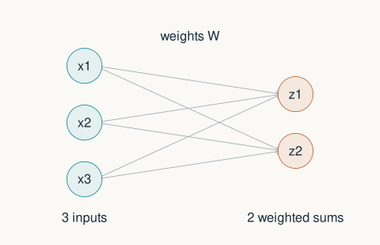{width=100% fig-alt="Three input nodes connect to two weighted-sum nodes through a matrix of six weights."}
:::
::: {.column width="45%"}
$$\underbrace{\mathbf z}_{2\times1}
=\underbrace{\mathbf W}_{2\times3}
\underbrace{\mathbf x}_{3\times1}
+\underbrace{\mathbf b}_{2\times1}$$

$$\mathbf y=g(\mathbf z)$$

Weights → sums → activation.
:::
::::

::: {.notes}
Optional, 2 minutes. Here we use column vectors consistently: W is 2 by 3, with each row collecting the weights feeding one output. The original used row vectors and the transposed weight convention; both work if dimensions agree. The matrix product is the weighted-sum step, not the whole network. Bias adds an offset and g is an activation function applied to each component. A non-linear activation makes the complete layer non-linear. This is a schematic mathematical model, not a detailed model of biological neurons.
:::

## Scaling changes the question PCA answers {.optional}

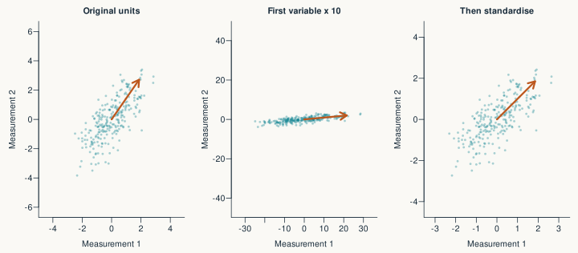{height=410 fig-alt="The first PCA direction changes when one variable is multiplied by ten; standardising both variables gives them equal variance before PCA."}

::: {.takeaway}
Centring removes offsets. **Standardising** also divides by each variable's SD.
:::

::: {.notes}
Optional, 3 minutes. The three panels show original units, a rescaled first variable, and then standardised variables. With mixed units, the choice needs justification; neither covariance PCA nor correlation PCA is universally right. Standardisation gives each non-constant variable unit variance, which can elevate noisy variables too. The script uses common units and keeps original relative variances. In R, scale(X, center=TRUE, scale=TRUE) standardises; do not apply it blindly to constant columns.
:::

## A few eigenvector caveats {.optional}

| Case | Meaning |
|:---|:---|
| $\lambda<0$ | Direction reverses |
| $\lambda=0$ | The vector maps to zero |
| $\mathbf v$ and $-\mathbf v$ | The same axis |
| Repeated eigenvalues | Directions inside that subspace need not be unique |

::: {.small}
Real symmetric covariance matrices have an orthonormal eigenbasis.<br>
Other real matrices need not have real eigenvectors.
:::

::: {.notes}
Optional, 2 minutes. A 90-degree rotation in a real two-dimensional plane has no nonzero real eigenvector. Covariance is the friendly special case needed for PCA. Numerical rounding can produce negligible negative values for a theoretically positive-semidefinite covariance matrix; substantial negative values indicate a different problem. Eigenvectors are not guaranteed to be distinct neural mechanisms, and their signs are conventional.
:::
